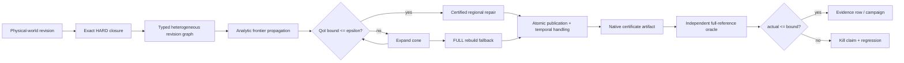

# MAVEB / AETHER

> **Dependency-certified minimal-work repair for persistent captured worlds, implemented inside a Metal-native reconstruction and rendering research engine.**

[](https://github.com/swayam8624/Maveb/actions/workflows/ci.yml)
[](https://github.com/swayam8624/Maveb/actions/workflows/studio-compile.yml)
[](https://github.com/swayam8624/Maveb/actions/workflows/apple-silicon-gpu.yml)


MAVEB is the research project. **AETHER** is the engine and captured-world systems stack used to test it.

The central research question is simple to state and difficult to make safe:

> **When a small part of a persistent captured world changes, how little work can we redo without silently changing the final output beyond a declared tolerance?**

A full rebuild is safe but expensive. A local heuristic is cheap but can miss hidden dependencies. MAVEB's proposed contribution is **Criticality-Bounded Revision Cones (CBRC)**: a fail-closed planner that mixes exact structural closure with conservative analytic change bounds and automatically falls back to a full rebuild when locality cannot be certified.

> [!IMPORTANT]
> **Implementation is complete. Real-scene performance evidence is the remaining research phase.**
> The repository does not turn fixtures, synthetic matrices, or missing measurements into speedup claims.

---

## The problem

Persistent captured worlds are not one representation. A physical edit can propagate through a heterogeneous stack:

- observations and provenance;
- sparse TSDF state;
- mesh ownership and topology;
- texture pages and material state;
- Gaussian primitives;
- GPU publication buffers;
- temporal history;
- final rendered quantities of interest.

That creates an uncomfortable tradeoff.

| Strategy | Safety | Work | Main failure mode |
|---|---|---:|---|
| Full rebuild | Strong | High | Recomputes unaffected state |
| Fixed spatial radius | Heuristic | Often low | Misses non-local dependencies |
| Changed-fraction threshold | Heuristic | Low | Ignores coupling structure |
| Empirical influence model | Predictive | Variable | Prediction is not a certificate |
| **CBRC** | **Fail-closed certificate** | **Adaptive** | Falls back to FULL when a safe local cone cannot be justified |

The target is not "always incremental." The target is:

> **Use a smaller repair cone only when the unrepaired exterior is conservatively bounded for the declared output. Otherwise rebuild.**

---

## Proposed novel solution: Criticality-Bounded Revision Cones

CBRC models one world revision as a typed dependency graph.

Each dependency is one of:

- **HARD** — exact identity, topology, ownership, provenance, publication, or invalidation dependency;
- **ANALYTIC** — a conservative finite-change upper bound with explicit provenance;
- **EMPIRICAL** — useful for scheduling experiments, but never trusted as a certificate.

For a candidate repair cone (C), CBRC asks whether every declared quantity of interest can satisfy:

```
certified_bound(C) <= epsilon
```

while exact dependencies remain closed. If yes, the cone is feasible. If not, the planner expands the cone or chooses the full reference rebuild.

The implementation also checks the emitted certificate against an independent full-reference replay:

```
measured_full_reference_error <= certified_bound <= epsilon
```

Any observed `actual > bound` is a correctness failure, not a noisy data point.

### Why this angle matters

The graph traversal itself is not the research novelty. Classical closure, resolvents, and sensitivity propagation already exist.

The proposed contribution is the **captured-world specialization and end-to-end systems contract**:

1. exact and analytic dependencies coexist in one heterogeneous revision graph;
2. only implementation-backed conservative bounds are certificate-eligible;
3. the repair objective is tied to explicit output QoIs rather than generic "change";
4. unsupported cycles and uncertain dependencies fail closed;
5. heterogeneous work is compared through a frozen versioned cost model rather than by adding incompatible counters;
6. every decision is serialized into machine-readable provenance and replayed against an independent full reference.

Novelty remains a research claim to be tested against prior art and peer review, not something the README can prove by assertion.

---

## Architecture



### V1 dependency boundary

**Analytic soft bounds**

- Gaussian revision → current-image RGB L∞ bound;
- stable temporal history/current image → resolved-image bound.

**Exact HARD dependencies by design**

- observation → TSDF;
- TSDF → mesh ownership/support;
- mesh → texture-page identity;
- texture page → material-state identity;
- Gaussian source record → GPU publication;
- unstable temporal validation / disocclusion.

Those HARD edges are not unfinished approximation work. V1 intentionally refuses to weaken dependencies without a useful conservative theorem.

---

## What is implemented

| Layer | Status |
|---|---|
| Dense Python reference planner | ✅ complete |
| Sparse C++23 planner | ✅ complete |
| HARD / ANALYTIC / EMPIRICAL edge semantics | ✅ complete |
| Greedy certified cone search | ✅ complete |
| FULL rebuild fallback | ✅ complete |
| Gaussian image certificate | ✅ complete |
| Temporal certificate / hard invalidation | ✅ complete |
| Observation→TSDF→mesh→texture/material graph | ✅ complete |
| Gaussian→GPU publication graph | ✅ complete |
| Heterogeneous `LocalityLedger` accounting | ✅ complete |
| Frozen scalar work-cost model | ✅ complete |
| Indexed persistent Gaussian edits | ✅ complete |
| Immutable revision sidecars | ✅ complete |
| Native deterministic certificate JSON | ✅ complete |
| Headless revision tool | ✅ complete |
| Independent Gaussian full-reference oracle | ✅ complete |
| Replay + strict evaluator | ✅ complete |
| Evidence bundle hashing | ✅ complete |
| Native ↔ Python planner parity gate | ✅ complete |
| Baselines + ablations | ✅ complete |
| Real-campaign automation | ✅ complete |
| F1–F8 paper-artifact generation | ✅ complete |
| CPU / sanitizer / static-analysis / app CI | ✅ complete |
| Real captured-scene campaign | ⏳ experiment pending |
| Final measured speedup/effectivity claims | ⏳ evidence pending |

See [the exact v1 boundary](research/design/CBRC_IMPLEMENTATION_STATUS.md).

---

## Research funnel

MAVEB did not start by coding a favorite idea.

The committed hypothesis bank contains **119 candidates**. The final filter froze the current paper line into:

- **5 locked headline hypotheses**;
- **16 required mechanisms**;
- **6 evaluation / ablation hypotheses**;
- **92 deferred follow-ups**.

The locked problem is:

> **Dependency-certified heterogeneous minimal-work repair for persistent captured worlds.**

The policy is intentionally adversarial: cheapest falsification first; kill or defer ideas when prior art, probes, held-out scenes, or ablations remove the claimed effect.

Start at [research/README.md](research/README.md).

---

## Expected impact

If the certificate remains useful on real scenes, the practical impact is broader than one renderer.

### Persistent XR and digital twins

A local physical edit should not force an entire room, site, or digital twin to be reconstructed and republished when most state is provably irrelevant to the requested output.

### Incremental reconstruction systems

CBRC provides a common decision layer over representations that normally have separate invalidation rules: TSDF, meshes, textures, Gaussians, GPU resources, and temporal state.

### Safer performance optimization

Instead of saying "this update probably stays local," the system emits the assumptions, cone, bound, cost model, fallback decision, and replay evidence that justify the optimization.

### Research reproducibility

A failed certificate is preserved as an artifact and becomes a regression. The project is designed so a negative result is useful rather than something to hide.

> [!NOTE]
> These are **potential impacts**. The repository does not claim a measured real-scene speedup until the frozen campaign is run on real captured-world revisions.

---

## Engine and systems stack

AETHER provides the experimental substrate:

- C++23 core with structured errors, profiling and deterministic resource handling;
- Metal renderer with bounded frames in flight and offline metallib compilation;
- SwiftUI macOS AetherStudio with an Objective-C++ bridge;
- Swift 6 iPad RGB + LiDAR capture companion;
- versioned `.aether` package format;
- canonical textured GLB export;
- standard 3D Gaussian Splatting PLY ingestion;
- CPU reference Gaussian rasterizer plus Metal 3 Gaussian path;
- reverse-Z proxy mesh G-buffer and Gaussian occlusion;
- glTF metallic-roughness material path;
- deterministic sparse CPU/Metal TSDF infrastructure;
- halo-consistent incremental CPU meshing;
- persistent-world revisions and locality evidence;
- [MavebBench](benchmarks/README.md) real-data evidence harness.

<details>
<summary><strong>What the repository deliberately does not claim</strong></summary>

- CBRC v1 is not a proof of global minimum-work optimality; the current search is greedy.
- Empirical Jacobians and learned sensitivities are not certificates.
- Unsupported analytic cycles are not assumed safe.
- Synthetic matrices do not establish real-world speedup.
- A full rebuild can be the correct answer for globally coupled edits.
- GPU-resident meshing and some broader production reconstruction gates remain separate roadmap items.
- Final publication claims require the frozen real-scene campaign.

See [CBRC limitations and threat model](research/design/CBRC_LIMITATIONS.md).

</details>

---

## Build

### Requirements

- Apple-silicon Mac;
- macOS 15 or newer;
- Xcode 26 or newer;
- CMake 3.28 or newer;
- Ninja;
- separately downloadable Xcode Metal Toolchain for Metal compilation.

Install the Metal compiler if needed:

```bash
xcodebuild -downloadComponent metalToolchain
```

### Development build

```bash
cmake --preset debug
cmake --build --preset debug
ctest --preset debug
open build/debug/apps/AetherStudio/AetherStudio.app
```

### CI-equivalent CPU build

```bash
cmake --preset ci
cmake --build --preset ci
ctest --preset ci
```

### Sanitizers

```bash
cmake --preset sanitizer
cmake --build --preset sanitizer
ctest --test-dir build/sanitizer --output-on-failure
```

---

## Run one certified revision

```bash
build/ci/tools/maveb-cbrc-revision/maveb-cbrc-revision \
  --archive /absolute/path/world.aetherworld \
  --entity 42 \
  --target 0.05,0.0,0.0 \
  --timestamp 1000000001 \
  --output-dir /tmp/cbrc-case \
  --width 1280 --height 720 \
  --focal-x 900 --focal-y 900 \
  --center-x 640 --center-y 360 \
  --epsilon 0.01
```

The headless path writes:

- `translation.json`;
- `certificate.json`;
- `native-planner-certificate.json`;
- new immutable Gaussian and ownership revision sidecars.

See [the full CBRC guide](docs/research/CBRC.md).

---

## Run the frozen real campaign

Start from [the campaign template](research/config/cbrc_real_campaign.example.json), freeze hardware work coefficients, then run:

```bash
python3 benchmarks/scripts/cbrc_campaign.py \
  --campaign /absolute/path/campaign.json \
  --oracle build/ci/tools/maveb-cbrc-gaussian-oracle/maveb-cbrc-gaussian-oracle \
  --revision-tool build/ci/tools/maveb-cbrc-revision/maveb-cbrc-revision \
  --git-sha "$(git rev-parse HEAD)" \
  --output-dir /absolute/path/cbrc-results
```

Default campaign gates require:

- a minimum revision count;
- at least one certified local case;
- at least one high/adversarial-coupling case;
- at least one automatic FULL fallback;
- zero certificate violations;
- native/Python planner parity.

Full procedure: [CBRC experiment runbook](research/results/CBRC_EXPERIMENT_RUNBOOK.md).

---

## Repository map

| Path | Purpose |
|---|---|
| [`engine/revision/`](engine/revision/) | Native typed revision graph and CBRC planner |
| [`engine/cbrc/`](engine/cbrc/) | Captured-world heterogeneous graph adapter |
| [`engine/world_gaussian/`](engine/world_gaussian/) | Gaussian ownership, locality and image certificates |
| [`engine/scene/`](engine/scene/) | Temporal revision certificate |
| [`engine/world/`](engine/world/) | Persistent-world and locality ledger |
| [`research/`](research/) | Hypotheses, theory, falsification, analysis and schemas |
| [`benchmarks/`](benchmarks/) | Real-data reconstruction and CBRC evidence campaigns |
| [`tools/maveb-cbrc-revision/`](tools/maveb-cbrc-revision/) | Headless persistent revision capture |
| [`tools/maveb-cbrc-gaussian-oracle/`](tools/maveb-cbrc-gaussian-oracle/) | Independent full-reference image oracle |
| [`apps/AetherStudio/`](apps/AetherStudio/) | macOS interactive application |
| [`apps/MavebCapture/`](apps/MavebCapture/) | iPad RGB + LiDAR capture companion |

---

## Documentation

**Research**

- [Research hub](research/README.md)
- [CBRC architecture and operator guide](docs/research/CBRC.md)
- [Implementation status](research/design/CBRC_IMPLEMENTATION_STATUS.md)
- [Limitations and threat model](research/design/CBRC_LIMITATIONS.md)
- [Result schema](research/results/CBRC_RESULT_SCHEMA.md)
- [Experiment runbook](research/results/CBRC_EXPERIMENT_RUNBOOK.md)
- [Machine-readable schemas](research/schema/README.md)

**Engine / formats**

- [Roadmap](docs/ROADMAP.md)
- [Benchmark contract](docs/BENCHMARKING.md)
- [AETHER package format](docs/formats/AETHER_PACKAGE.md)
- [Canonical Asset v1](docs/formats/CANONICAL_ASSET.md)
- [Native GLB export](docs/formats/NATIVE_GLB_EXPORT.md)
- [Gaussian PLY profile](docs/formats/GAUSSIAN_PLY.md)
- [Reconstruction truth ADR](docs/adr/0005-reconstruction-truth-and-oracle-first.md)

---

## Evidence philosophy

> [!CAUTION]
> A certificate violation is never averaged away.

Every certified result must satisfy:

```
measured_full_reference_error <= certified_bound <= epsilon
```

Every result archive should retain the exact git SHA, graph/bound/cost-model versions, input revisions, camera, chosen cone, full-reference output, raw heterogeneous work counters, and failed artifacts.

That is the standard the project uses before paper prose is allowed to become a performance claim.

---

## Repository history

The original Metal learning tree is preserved on `archive/metal-practice-2026-07-12`. The maintained tutorial starts under `examples/00_triangle`.

Historical research branches are temporary working lines; **`main` is the canonical final project branch** once the CBRC integration PR lands.

---

## License

AETHER/MAVEB source code is licensed under Apache-2.0. Documentation is licensed under CC BY 4.0 unless a file states otherwise. Datasets and third-party assets keep their original licenses and are never implicitly covered by the source license.
