<h1 align="center">MAVEB</h1>

<h3 align="center">Criticality-Bounded Revision Cones for Persistent Captured Worlds</h3>

<p align="center">
A research system for deciding how little of a captured 3D world can be recomputed after a physical edit while keeping the final output inside an explicit error tolerance.
</p>

<p align="center">
<a href="https://github.com/swayam8624/Maveb/actions/workflows/ci.yml"></a>
<a href="https://github.com/swayam8624/Maveb/actions/workflows/studio-compile.yml"></a>


</p>

<p align="center">
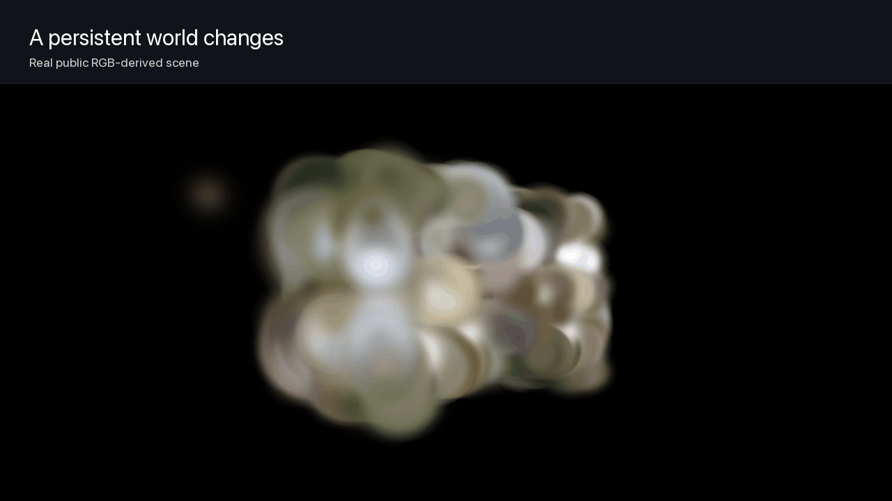
</p>

MAVEB is the research project. AETHER is the reconstruction, persistent-world, rendering, revision, and evidence stack used to test it.

The project asks one question:

> When a small part of a captured world changes, how little work can be redone without allowing the final output to drift beyond a declared tolerance?

The central method is **Criticality-Bounded Revision Cones**, abbreviated **CBRC**. CBRC combines exact dependency closure, conservative finite-change bounds, quantity-of-interest tolerances, a heterogeneous work model, and an automatic full-rebuild fallback. A regional repair is accepted only when the unrepaired exterior can be certified. If the system cannot prove locality, it rebuilds.

The v1 implementation, frozen public real-scene campaign, trained-3DGS validation, sparse-discovery study, mechanism-isolation suite, publication figures, animated supplementary material, reproducibility infrastructure, and manuscript package are complete. The next stage is venue-specific submission preparation and final artifact packaging.

## Contents

1. [Visual overview](#visual-overview)
2. [Problem statement](#problem-statement)
3. [Research hypothesis](#research-hypothesis)
4. [CBRC in one page](#cbrc-in-one-page)
5. [Mathematical formulation](#mathematical-formulation)
6. [System architecture](#system-architecture)
7. [Visual results](#visual-results)
8. [Frozen evidence](#frozen-evidence)
9. [Research journey](#research-journey)
10. [Literature lineage](#literature-lineage)
11. [Novelty boundary](#novelty-boundary)
12. [Impact](#impact)
13. [Limitations](#limitations)
14. [Reproducibility](#reproducibility)
15. [Repository map](#repository-map)
16. [Manuscript boundary](#manuscript-boundary)
17. [References](#references)

# Visual overview

<table>
<tr>
<td width="50%" align="center">
<a href="research/results/visualizations/public/F0_hero.png">
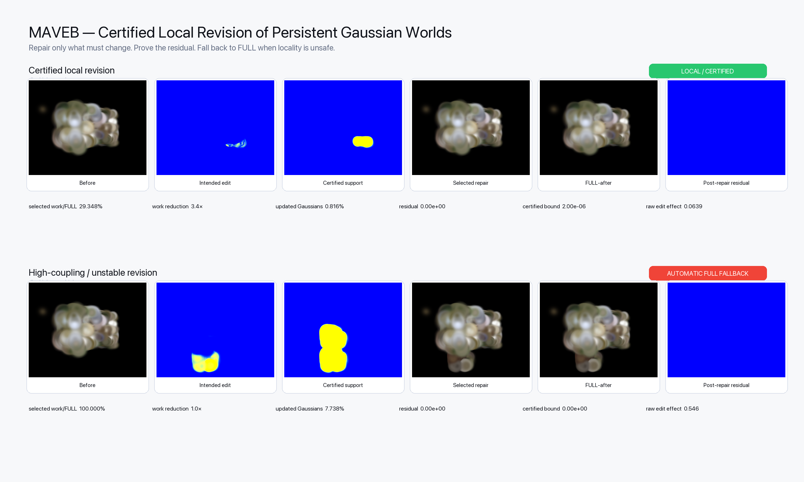
</a>
<br>
<sub>Public real-scene campaign. Revise locally when the exterior can be bounded, otherwise rebuild.</sub>
</td>
<td width="50%" align="center">
<a href="research/results/visualizations/public/F0_system_overview.svg">
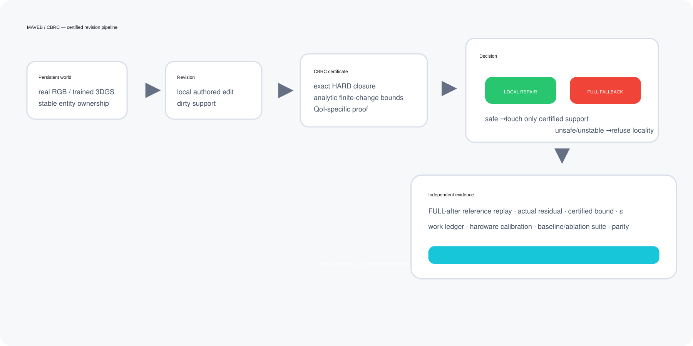
</a>
<br>
<sub>System view of the revision graph, certificate path, selected cone, full fallback, and independent oracle.</sub>
</td>
</tr>
<tr>
<td width="50%" align="center">
<a href="research/results/visualizations/public/F9_evidence_dashboard.png">
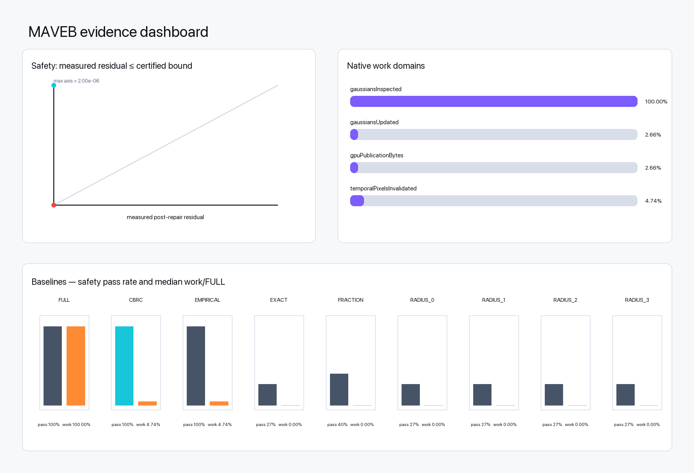
</a>
<br>
<sub>Public campaign evidence dashboard.</sub>
</td>
<td width="50%" align="center">
<a href="research/results/visualizations/public/F10_case_mosaic.png">
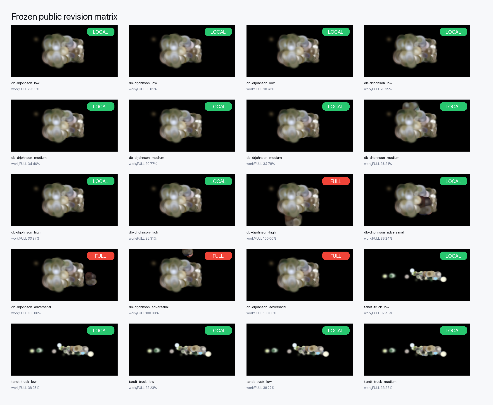
</a>
<br>
<sub>Frozen public revision cases shown as a compact visual matrix.</sub>
</td>
</tr>
</table>

The repository stores inline motion material as GIFs so GitHub renders and plays it directly inside the README. Full-resolution figures are linked through the images themselves.

<table>
<tr>
<td width="50%" align="center">

<br>
<sub>Public campaign teaser.</sub>
</td>
<td width="50%" align="center">
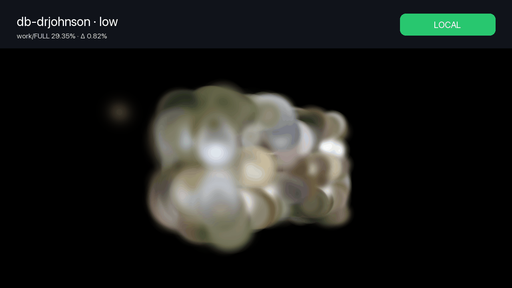
<br>
<sub>Public supplementary revision cases.</sub>
</td>
</tr>
<tr>
<td width="50%" align="center">
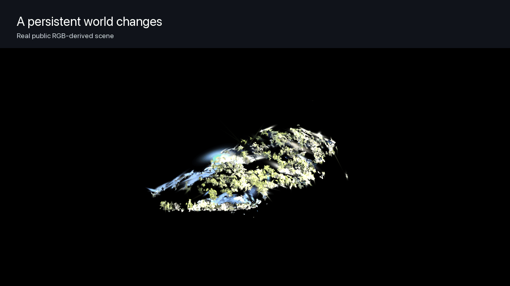
<br>
<sub>Trained-3DGS validation teaser.</sub>
</td>
<td width="50%" align="center">
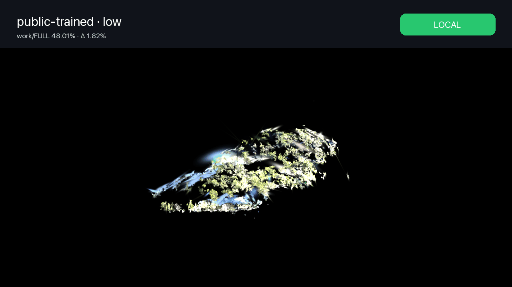
<br>
<sub>Trained-3DGS supplementary cases.</sub>
</td>
</tr>
</table>

# Problem statement

Persistent captured worlds are not one representation. A practical system may contain observations, camera calibration, sparse or dense geometry, ownership records, texture pages, materials, Gaussian primitives, GPU publication buffers, temporal history, visibility state, and final display-space outputs.

A physical edit that looks local in world space can therefore have a non-local computational footprint.

Consider a reconstructed room. A chair moves by a few centimetres. A naive incremental system can choose a spatial radius and update only nearby data. That may be fast, but the radius does not establish that the unchanged exterior is actually safe. A conservative system can rebuild the entire world. That is reliable, but it discards locality even when most captured state cannot influence the protected output.

The research problem is the gap between these choices.

| Strategy | Main advantage | Main weakness |
|---|---|---|
| Full rebuild | Simple reference behavior | Recomputes unaffected state |
| Fixed-radius update | Cheap and intuitive | Radius is not an output-error certificate |
| Changed-fraction threshold | Simple scheduling signal | Ignores dependency structure |
| Learned or empirical influence | Can predict useful locality | Prediction is not a conservative certificate |
| CBRC | Output-specific, fail-closed regional repair | Can become conservative and fall back to FULL |

The objective is not to force local repair. The objective is to make locality conditional on a certificate.

For a candidate regional repair $C$, MAVEB requires

```math
E_q^{\mathrm{full-ref}}
\le
B_q(C)
\le
\varepsilon_q
```
for every declared quantity of interest $q$.

Here:

- $E_q^{\mathrm{full-ref}}$ is measured against an independent full-reference replay.
- $B_q(C)$ is the emitted conservative certificate.
- $\varepsilon_q$ is the declared application tolerance.

Any observed case with

```math
E_q^{\mathrm{full-ref}} > B_q(C)
```
is a correctness failure.

# Research hypothesis

The v1 hypothesis is:

> A persistent captured-world revision can often be restricted to a dependency-certified repair cone that is cheaper than a full rebuild, provided exact dependencies are closed, soft dependencies are bounded conservatively, and unsupported coupling triggers a full fallback.

The hypothesis is deliberately narrow.

A small spatial edit is not automatically a small computational edit.

Empirical influence is not accepted as proof.

A safe algorithm is allowed to choose FULL.

The current search claims a certified feasible cone, not a globally optimal minimum-work cone.

# CBRC in one page

For one world revision, CBRC performs the following sequence.

1. Detect the source change and construct a direct change envelope.
2. Close all exact HARD predecessors required to reproduce affected state.
3. Partition the graph into repair cone $C$ and unrepaired exterior $O$.
4. Propagate conservative ANALYTIC influence through the exterior.
5. Map the exterior envelope to protected output quantities.
6. Compare every output bound with its declared tolerance.
7. Expand the cone when necessary.
8. Compare calibrated regional work with an independently measured full-work baseline.
9. Return a local repair only when it is both certified and useful.
10. Otherwise return FULL.
11. Replay the selected result against an independent full reference.
12. Preserve the decision, bound, work model, provenance, and oracle result as machine-readable evidence.

The graph contains three edge classes.

| Edge class | Meaning | Safety role |
|---|---|---|
| HARD | Exact dependency, identity, ownership, topology, publication, or invalidation requirement | Exact closure |
| ANALYTIC | Conservative implementation-backed finite-change upper bound | Certificate eligible |
| EMPIRICAL | Measured or learned influence useful for scheduling | Never treated as proof |

# Mathematical formulation

## State graph

Let the captured-world state be represented by blocks

```math
V = \{1,\ldots,n\}.
```
A block may represent an observation region, TSDF block, mesh patch, texture page, Gaussian subset, GPU publication region, temporal-history region, or another derived state unit.

For a revision, CBRC chooses a repair cone

```math
C \subseteq V
```
and defines the unrepaired exterior

```math
O = V \setminus C.
```
## HARD predecessor closure

If $v$ is repaired and $u$ is an exact predecessor required to reproduce $v$, then

```math
v\in C,\qquad
u\in\mathrm{Pred}_{\mathrm{HARD}}(v)
\Longrightarrow
u\in C.
```
A candidate cone that violates exact predecessor closure is invalid before analytic error is considered.

## Conservative influence matrix

For ANALYTIC edges, define a componentwise non-negative matrix

```math
K \in \mathbb{R}_{\ge0}^{n\times n},
```
where

```math
K_{vu}
```
is a conservative upper bound on how much normalized change in state block $u$ can influence state block $v$.

Let

```math
b\in\mathbb{R}_{\ge0}^{n}
```
be the direct source-change envelope and let

```math
z\in\mathbb{R}_{\ge0}^{n}
```
contain known change bounds for repaired state.

For the exterior,

```math
\delta_O
\le
b_O + K_{OC}z_C + K_{OO}\delta_O.
```
The first term is direct change in the exterior. The second is influence crossing from repaired state to unrepaired state. The third is repeated propagation inside the exterior.

## Exterior resolvent

When

```math
\rho(K_{OO}) < 1,
```
the resolvent

```math
G_O=(I-K_{OO})^{-1}
```
exists for the certified non-negative system.

Using the Neumann expansion,

```math
(I-K_{OO})^{-1}
=
I+K_{OO}+K_{OO}^{2}+\cdots.
```
The exterior envelope becomes

```math
\boxed{
\hat\delta_O
=
G_O\left(b_O+K_{OC}z_C\right)
}
```
with

```math
\delta_O\le\hat\delta_O.
```
The matrix identity is classical. The research use is the captured-world specialization that connects implementation-backed dependency bounds to a revision decision.

Unsupported analytic cycles or unstable exteriors fail closed.

## Quantity-of-interest certificate

For output quantity $q$, let $R_q$ map state perturbations to the protected output and let the allowed tolerance be

```math
\varepsilon_q\ge0.
```
CBRC evaluates

```math
\boxed{
B_q(C)
=
\left\|
|R_{q,O}|\hat\delta_O
\right\|_\infty
}
```
and accepts the cone only when

```math
B_q(C)\le\varepsilon_q
```
for every protected output.

The experiment harness checks the stronger contract

```math
\boxed{
E_q^{\mathrm{full-ref}}
\le
B_q(C)
\le
\varepsilon_q.
}
```
## Gaussian rendering bound

For a projected Gaussian at pixel $p$, the renderer-compatible effective alpha model is

```math
\alpha_i(p)
=
o_i\exp\left(-\frac12q_i(p)\right),
```
where $o_i$ is peak opacity and $q_i(p)$ is squared Mahalanobis distance in projected Gaussian space.

For edited set $E$, define aggregate opacity mass

```math
A(E)=1-\prod_{i\in E}(1-\alpha_i).
```
If the relevant color interval has width $C_{\mathrm{color}}$,

```math
\left\|R(U\cup E)-R(U)\right\|_\infty
\le
C_{\mathrm{color}}A(E).
```
For before and after edited states $E_0,E_1$,

```math
\boxed{
\left\|R(U\cup E_0)-R(U\cup E_1)\right\|_\infty
\le
C_{\mathrm{color}}
\min\left(1,A(E_0)+A(E_1)\right)
}
```
and over protected pixels $P$,

```math
B_P=
\max_{p\in P}
C_{\mathrm{color}}
\min\left(1,A_{0,p}+A_{1,p}\right).
```
This turns Gaussian support into a display-space error certificate rather than a heuristic notion of locality.

## Temporal-history bound

For stable temporal validation, let

- $E_c$ be current-frame error.
- $E_h$ be retained-history error.
- $E_n$ be neighborhood or clamping error.
- $w\in[0,1]$ be history weight.

Define

```math
E_r=\max(E_h,E_n).
```
Then

```math
\boxed{
E_{\mathrm{resolved}}
=
(1-w)E_c+wE_r.
}
```
If validation or disocclusion itself may change, the dependency becomes HARD and the affected temporal history is invalidated.

For repeated stable history reuse,

```math
E_t\le E_0w^t.
```
## Heterogeneous work model

The planner does not add incompatible counters directly.

For work domain $d$, let $n_d(C)$ be native work and $\kappa_d$ be a frozen calibrated cost per native unit.

The scalar comparison is

```math
\boxed{
W(C)
=
\sum_d\kappa_dn_d(C).
}
```
The independent full baseline is

```math
W_{\mathrm{full}}.
```
A certified local result is useful only when

```math
W(C)<W_{\mathrm{full}}.
```
The coefficients are frozen before the final campaign.

## Greedy cone expansion

Define normalized violation

```math
\phi(C)
=
\max_q
\frac{B_q(C)}
{\max(\varepsilon_q,\epsilon_{\mathrm{num}})}.
```
A passing cone satisfies

```math
\phi(C)\le1.
```
For candidate expansion $C\rightarrow C'$, the greedy utility is

```math
\mathrm{utility}(C\rightarrow C')
=
\frac{\phi(C)-\phi(C')}
{W(C')-W(C)}.
```
Every candidate is closed over HARD predecessors, re-certified, and compared with FULL.

The result is a certified feasible cone, not a proof of global combinatorial optimality.

## Susceptibility

Exterior susceptibility is reported as

```math
S_O=
\left\|
(I-K_{OO})^{-1}
\right\|_1.
```
It is a diagnostic for perturbation amplification, not a replacement for the QoI certificate.

## Effectivity

For non-zero independent measured residual,

```math
\eta
=
\frac{B_q(C)}
{E_q^{\mathrm{full-ref}}}.
```
When measured residual is numerically zero, effectivity is undefined. The reporting code does not divide by an arbitrary tiny denominator.

# System architecture

<pre>
Physical revision
       |
       v
Source change envelope
       |
       v
Exact HARD closure
       |
       v
Typed revision graph
       |
       v
Analytic exterior propagation
       |
       v
QoI certificate <= tolerance?
       |
   +---+---+
   |       |
  yes      no
   |       |
   v       v
candidate  expand cone
local      or FULL
   |       |
   +---+---+
       |
       v
Compare regional work with FULL
       |
       v
Execute selected repair
       |
       v
Atomic publication and temporal handling
       |
       v
Native certificate artifact
       |
       v
Independent full-reference replay
       |
       v
measured error <= certificate?
       |
   +---+---+
   |       |
  yes      no
   |       |
evidence   correctness failure
row        and regression
</pre>

| Component | Role |
|---|---|
| [engine/revision](engine/revision) | Sparse native C++ revision planning and execution |
| [research/cbrc](research/cbrc) | Dense reference certifier, bounds, search, and work model |
| [tools/maveb-cbrc-gaussian-oracle](tools/maveb-cbrc-gaussian-oracle) | Independent full-reference Gaussian oracle |
| [benchmarks/scripts](benchmarks/scripts) | Campaign execution, replay, evaluation, calibration, sparse discovery |
| [research/analysis](research/analysis) | Paper artifacts, evidence checks, and readiness |
| [research/experiments](research/experiments) | Baselines, ablations, and falsification |
| [research/results](research/results) | Frozen evidence and publication visuals |

## V1 dependency boundary

Analytic soft bounds:

- Gaussian revision to protected current-image RGB.
- Stable current-image and temporal-history error to resolved output.

Exact dependencies by design:

- Observation to TSDF.
- TSDF to mesh support and ownership.
- Mesh to texture-page identity.
- Texture page to material-state identity.
- Gaussian source record to GPU publication.
- Unstable temporal validation or disocclusion to temporal invalidation.

A dependency is weakened only when a useful conservative finite-change theorem exists.

# Visual results

## Core paper figures

<table>
<tr>
<td width="33.333%" align="center">
<a href="research/results/visualizations/paper/F1_actual_vs_bound.svg">
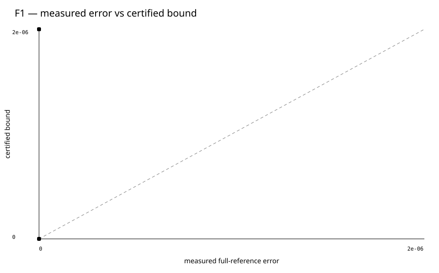
</a><br><sub>F1. Independent measured error against emitted certificate.</sub>
</td>
<td width="33.333%" align="center">
<a href="research/results/visualizations/paper/F2_work_vs_changed_fraction.svg">
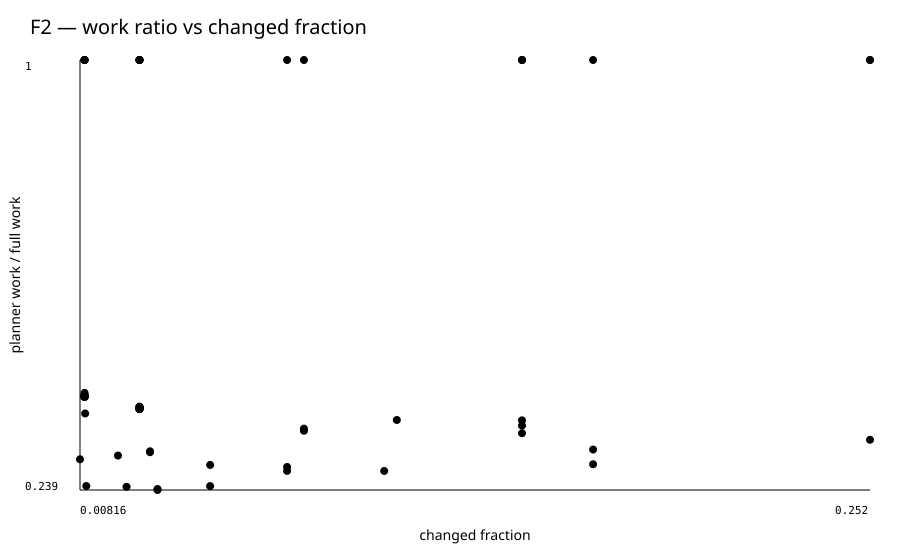
</a><br><sub>F2. Selected work as revision size changes.</sub>
</td>
<td width="33.333%" align="center">
<a href="research/results/visualizations/paper/F3_coupling_cone.svg">
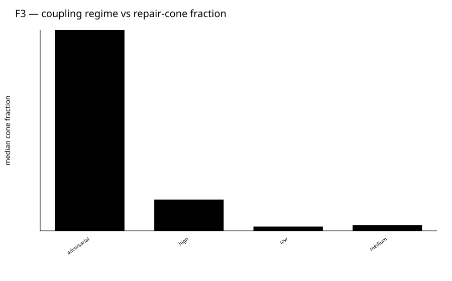
</a><br><sub>F3. Coupling structure and repair-cone response.</sub>
</td>
</tr>
<tr>
<td width="33.333%" align="center">
<a href="research/results/visualizations/paper/F4_fallback_crossover.svg">
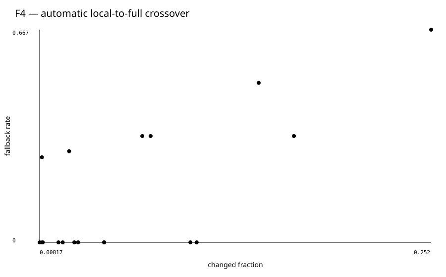
</a><br><sub>F4. Local-to-FULL crossover under increasing coupling.</sub>
</td>
<td width="33.333%" align="center">
<a href="research/results/visualizations/paper/F5_effectivity.svg">
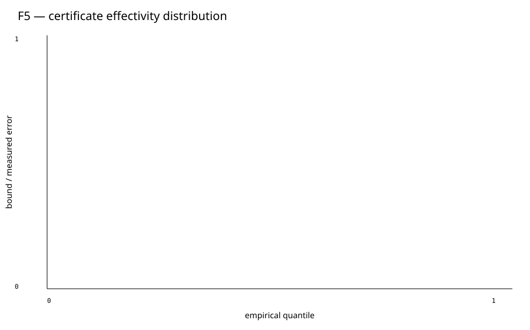
</a><br><sub>F5. Certificate effectivity where independent residual is non-zero.</sub>
</td>
<td width="33.333%" align="center">
<a href="research/results/visualizations/paper/F6_layer_work.svg">
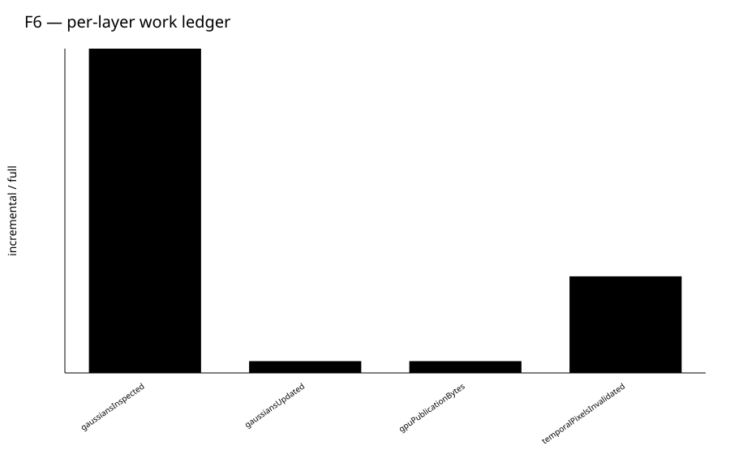
</a><br><sub>F6. Work distribution across captured-world layers.</sub>
</td>
</tr>
</table>

<table>
<tr>
<td width="50%" align="center">
<a href="research/results/visualizations/paper/F7_cone_support_residual.svg">

</a><br><sub>F7. Spatial support, selected cone, and residual structure.</sub>
</td>
<td width="50%" align="center">
<a href="research/results/visualizations/paper/F8_adversarial_fallback.svg">
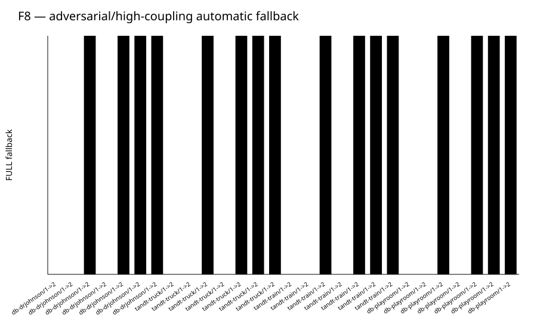
</a><br><sub>F8. Adversarial or unstable cases trigger fail-closed behavior.</sub>
</td>
</tr>
</table>

## Sparse discovery and representation validation

<table>
<tr>
<td width="50%" align="center">
<a href="research/results/visualizations/sparse/F11_sparse_discovery.svg">
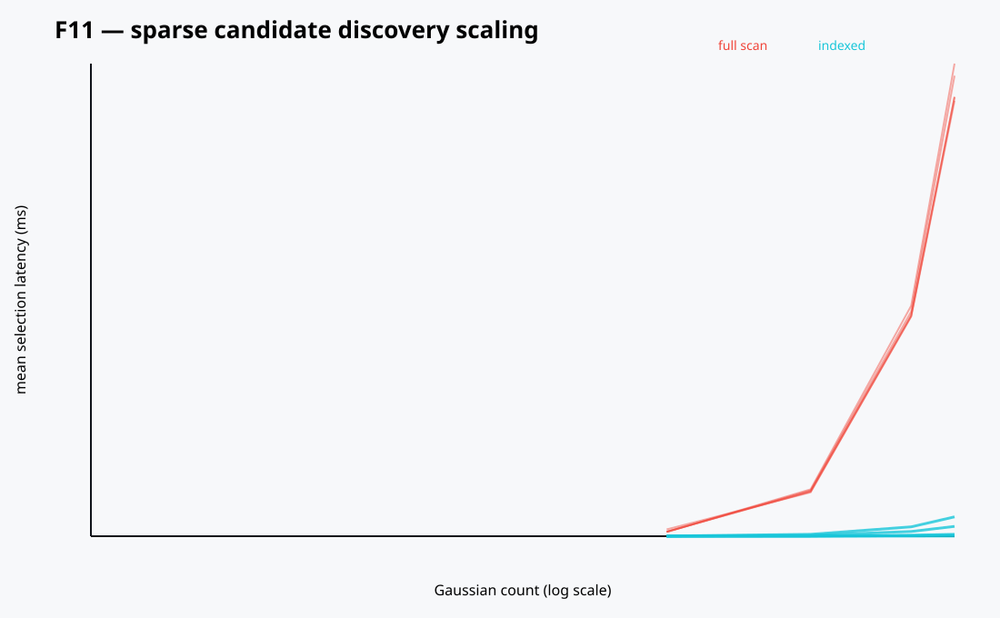
</a><br><sub>F11. Exact sparse candidate discovery through the scaling sweep.</sub>
</td>
<td width="50%" align="center">
<a href="research/results/visualizations/representation/F12_representation_comparison.svg">
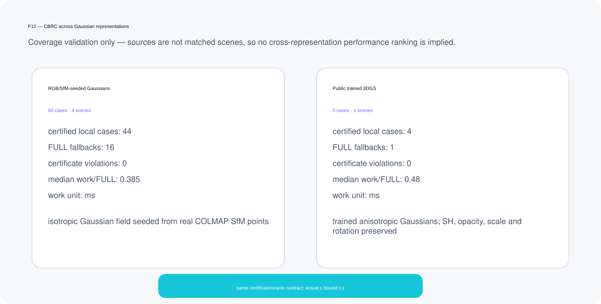
</a><br><sub>F12. Public RGB/SfM campaign and trained-3DGS validation under the same safety contract.</sub>
</td>
</tr>
</table>

## Trained-3DGS validation

<table>
<tr>
<td width="50%" align="center">
<a href="research/results/visualizations/trained-3dgs/F0_trained_3dgs_hero.png">
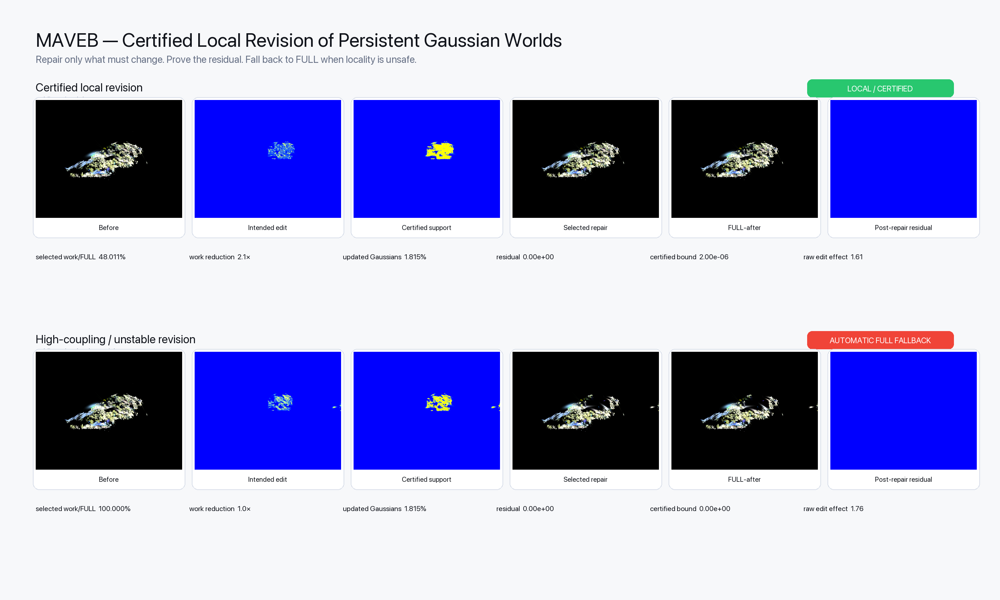
</a><br><sub>Trained-3DGS hero frame.</sub>
</td>
<td width="50%" align="center">
<a href="research/results/visualizations/trained-3dgs/F0_system_overview.svg">
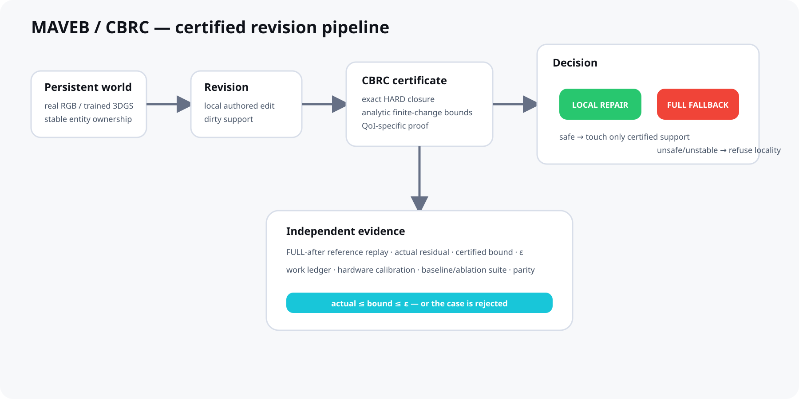
</a><br><sub>Trained-3DGS system view.</sub>
</td>
</tr>
<tr>
<td width="50%" align="center">
<a href="research/results/visualizations/trained-3dgs/F9_trained_3dgs_evidence_dashboard.png">
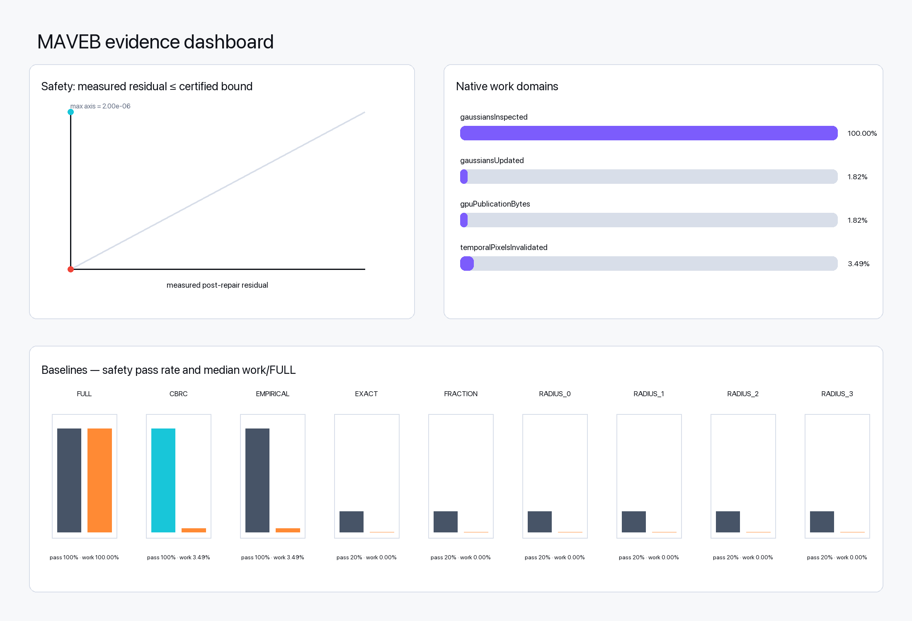
</a><br><sub>Trained-3DGS evidence dashboard.</sub>
</td>
<td width="50%" align="center">
<a href="research/results/visualizations/trained-3dgs/F10_trained_3dgs_case_mosaic.png">
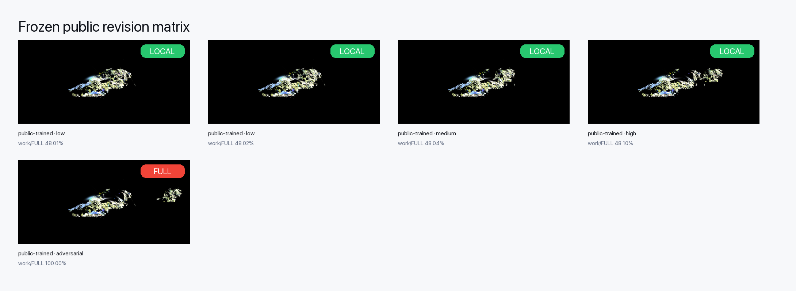
</a><br><sub>Trained-3DGS revision mosaic.</sub>
</td>
</tr>
</table>

All committed visual files, including canonical packaging aliases, live under [research/results/visualizations](research/results/visualizations).

# Frozen evidence

Canonical evidence:

- [Machine-readable evidence manifest](research/results/CBRC_CANONICAL_EVIDENCE_2026-09-21.json)
- [Human-readable evidence freeze](research/results/CBRC_CANONICAL_EVIDENCE_2026-09-21.md)
- [Strict claim ledger](research/results/CBRC_CLAIM_LEDGER_2026-09-21.md)

## Public RGB/SfM campaign

| Measurement | Frozen result |
|---|---:|
| Revision cases | 60 |
| Public scenes | 4 |
| Certified-local selections | 44 |
| Automatic FULL fallbacks | 16 |
| Observed certificate violations | 0 |
| Native/Python output-cone planner parity | 60 / 60 |
| Source edits above protected RGB tolerance before repair | 56 / 60 |
| Median calibrated four-domain work / FULL | 0.36953 |
| Calibrated work reduction factor | 2.706x |
| Maximum measured selected support-replay residual | 0.0 |
| Maximum selected certified bound | $2\times10^{-6}$ |
| Sparse-discovery median inspected fraction | 0.01 |
| Sparse-discovery minimum inspected fraction | 0.001 |
| LOCAL selected renders matching FULL-after at 8-bit RGB | 44 / 44 |
| Median before-to-FULL changed-pixel fraction | 1.74% |
| Views with at least one changed pixel | 57 / 60 |

The 2.706x value is a reduction in calibrated four-domain work under the frozen millisecond model. It is not a paired end-to-end wall-clock speedup.

The public RGB/SfM path uses canonical scene-scale normalization. Its Gaussian field is seeded from real SfM points and is not described as trained photorealistic 3DGS. The rendered-fidelity audit compares each selected benchmark-view render against the independent FULL-after render of the same representation and camera; it is repair-fidelity evidence, not a photorealistic reconstruction score against source photographs.

## Trained-3DGS validation

| Measurement | Frozen result |
|---|---:|
| Revision cases | 5 |
| Trained public scenes | 1 |
| Certified-local selections | 4 |
| Automatic FULL fallbacks | 1 |
| Observed certificate violations | 0 |
| Median native temporal/output work / FULL | 0.03495 |
| Native work reduction factor | 28.614x |
| Median Gaussian inspection ratio | 0.9999972 |
| Maximum measured selected support-replay residual | 0.0 |
| Maximum selected certified bound | $2\times10^{-6}$ |
| LOCAL trained-3DGS renders matching FULL-after | 4 / 4 |
| Median before-to-FULL changed-pixel fraction | 2.23% |

The 28.614x value is lower native temporal/output work under that campaign definition. It is not wall-clock speedup.

The pinned source PLY SHA-256 is:

<pre>f03e4979ac27345da1422d960d604b98db9541bdb3586d135d64bb4d9bde8eb3</pre>

The representation preserves spherical-harmonic coefficients, opacity, anisotropic scale, and rotation. Persistent spatial ownership is deterministic rather than semantic segmentation.

## Sparse discovery

The frozen end-to-end paths still inspect almost the complete Gaussian set.

A separate sparse-discovery sweep preserves exact candidate selection while reducing the inspected fraction to a median of 1 percent, with a minimum of 0.1 percent through the sweep up to one million Gaussians.

This result is reported separately because the frozen end-to-end work number does not silently credit an optimization that was not integrated into that measured ledger.

# Research journey

MAVEB was developed as a falsification-first research program rather than by fixing a desired conclusion and constructing evidence around it.

The hypothesis bank reached 119 candidates.

| Research-funnel state | Count |
|---|---:|
| Locked headline hypotheses | 5 |
| Required mechanisms | 16 |
| Evaluation and ablation hypotheses | 6 |
| Deferred follow-ups | 92 |

The final problem became:

> Dependency-certified heterogeneous minimal-work repair for persistent captured worlds.

## Mathematical viability

The first phase asked whether conservative exterior response could survive cheap counterexamples.

This established exact predecessor closure, non-negative analytic influence, finite or stable exterior propagation, QoI-specific bounds, fail-closed handling of unsupported coupling, Gaussian display-space bounds, and temporal-history bounds.

Randomized Gaussian and temporal falsification was used before expensive systems integration.

## Dense reference implementation

A Python implementation was built as the correctness reference.

It supplies certificate construction, resolvent evaluation, QoI bounds, greedy cone expansion, work accounting, baselines, ablations, and synthetic mechanism-isolation cases.

## Native system integration

The method was then integrated into the C++23 persistent-world stack.

The native path includes sparse revision planning, persistent ownership, Gaussian publication planning, temporal invalidation, immutable revision records, deterministic certificate JSON, and headless execution tools.

Native and Python output-cone planner decisions are checked for parity.

## Independent oracle

A certifier cannot be trusted merely because its own internal checks pass.

The final campaign uses an independent full-after oracle to falsify the unrepaired exterior implied by each selected support.

<pre>measured support-replay residual <= certificate <= tolerance</pre>

## Public campaign

The final public campaign was frozen before outcomes were interpreted.

An early v2 execution exposed a protocol issue: one requested translation was below the production effective-edit threshold. That run remains preserved as protocol history.

The campaign was corrected by enforcing the production precondition before freezing v2.1 revisions.

The corrected campaign was then rerun and frozen.

## Trained-3DGS representation check

The public RGB/SfM path was not treated as sufficient evidence of transfer to a trained Gaussian representation.

A second path therefore uses a pinned public trained 3DGS PLY while preserving SH coefficients, opacity, anisotropic scale, and rotation.

## Claim freeze

The implementation phase ended by separating supported statements from attractive but unsupported statements.

The repository now preserves the canonical evidence manifest, claim ledger, limitations, visual package, mechanism-isolation suite, and reproducibility scripts.

# Literature lineage

MAVEB sits at the intersection of real-time reconstruction, persistent scene representations, neural rendering, Gaussian rendering, dynamic scene models, and incremental map maintenance.

The literature below is a lineage, not an assertion that any one prior system solves the same decision problem.

## Volumetric reconstruction

Curless and Levoy established volumetric integration as a foundational approach for combining range observations into an implicit surface.

KinectFusion demonstrated real-time dense mapping and camera tracking by fusing depth into a global implicit surface model and tracking against the growing model.

These systems establish persistent fused scene state. They do not by themselves give a general output-error certificate for selecting a heterogeneous subset of reconstruction, rendering, publication, and temporal work after a persistent-world revision.

## Surfel maps and reintegration

Surfels established point-oriented surface elements without explicit mesh connectivity.

ElasticFusion demonstrated incremental dense surfel mapping with local and global model correction.

BundleFusion showed real-time globally consistent reconstruction with online surface reintegration.

These systems are close conceptual antecedents because they maintain and revise persistent map state. MAVEB asks a different question: given a revision and a protected output tolerance, can a smaller repair be certified against the result of rebuilding everything?

## Neural scene representations

NeRF established continuous neural radiance fields for novel-view synthesis.

iMAP brought a scene-specific neural implicit representation into live SLAM.

NICE-SLAM introduced hierarchical local scene information to improve scalability and reconstruction detail.

These methods changed both the representation and the cost structure of map updates. They strengthen the motivation for explicit reasoning about which state must be revisited after change.

CBRC is representation-agnostic at the top level. It requires exact dependencies and conservative finite-change bounds rather than a particular representation class.

## Gaussian scene representations

3D Gaussian Splatting introduced an explicit anisotropic Gaussian scene representation with high-quality real-time radiance-field rendering.

Dynamic 3D Gaussians and 4D Gaussian Splatting extended Gaussian representations toward persistent motion and dynamic rendering.

These works are directly relevant because explicit Gaussian support, opacity, covariance, and color can be related to conservative display-space bounds.

MAVEB does not claim to invent Gaussian rendering or dynamic Gaussian representations. Its Gaussian role is to connect implementation-compatible splat support to a fail-closed revision certificate.

## The gap addressed by MAVEB

The ingredients around MAVEB already exist independently:

- incremental state update;
- local map maintenance;
- spatial support;
- dependency graphs;
- matrix resolvents;
- sensitivity propagation;
- output-error estimation;
- empirical influence prediction;
- full-reference evaluation.

The proposed contribution is the captured-world specialization that places them under one revision contract:

1. Exact and analytic dependencies coexist.
2. Safety is defined at an explicit output quantity.
3. A local result is accepted only when its exterior is conservatively bounded.
4. Unsupported coupling selects FULL.
5. Heterogeneous work is compared under a frozen model.
6. The selected result is checked against an independent full reference.
7. Every decision and failure is preserved as evidence.

Peer review, broader comparison, and independent replication remain necessary to establish generality and novelty beyond the evaluated system.

# Novelty boundary

## Not claimed as novel

MAVEB does not claim to invent graph reachability, transitive closure, predecessor closure, spectral radius, Neumann-series resolvents, matrix sensitivity propagation, Gaussian splatting, alpha compositing, TSDF fusion, temporal filtering, greedy search, learned scheduling heuristics, or full-reference evaluation.

## Proposed contribution

The proposed contribution is:

- a typed revision graph spanning heterogeneous captured-world and runtime state;
- exact HARD closure and conservative ANALYTIC bounds in one planner;
- display-space or task-space quantities of interest;
- fail-closed unsupported coupling;
- heterogeneous work-aware cone selection;
- native and reference planner parity;
- independent full-reference falsification;
- machine-readable evidence for every decision.

## Claims intentionally not made

The current evidence does not establish universal safety outside stated assumptions and the tested domain, global combinatorial minimum-work optimality, paired end-to-end wall-clock speedup over FULL, semantic object ownership in the trained-3DGS validation, metric-scale reconstruction in the public RGB/SfM path, necessity of every mechanism on every real workload, safety of empirical influence prediction, or publication acceptance.

# Impact

## Persistent XR

Persistent XR systems accumulate world state over long periods. Real spaces change. Furniture moves, surfaces change, objects appear, and earlier captured geometry becomes stale.

A full reconstruction after every edit is wasteful. An unconstrained local update can preserve stale dependent state.

CBRC supplies a decision layer between these extremes.

## Digital twins

Digital twins combine geometry, appearance, sensor history, simulation state, and GPU resources.

A local physical change can require selective invalidation across several representations.

A typed revision graph provides one place to express those dependencies.

## Incremental reconstruction

Many reconstruction systems already perform local work.

CBRC adds a different requirement: local work should be justified against an explicit output tolerance when a conservative bound is available.

## Rendering systems

The same principle applies beyond reconstruction.

A renderer with persistent caches, temporal history, visibility structures, explicit scene primitives, and publication buffers can expose a revision graph.

The method is therefore best interpreted as a framework for certified recomputation rather than a single Gaussian optimization.

## Reproducible systems research

Failed certificates remain scientific artifacts.

A violation is not averaged away. It becomes a regression target.

This makes correctness failures visible alongside performance results.

# Limitations

## Gaussian discovery remains expensive

Median Gaussian inspection relative to FULL remains approximately 1.0 in both frozen end-to-end campaign paths.

Update, publication, and temporal work can be much smaller, but discovery still scans almost the entire field.

Sparse discovery shows a route toward removing this bottleneck, but the frozen end-to-end headline number does not include that unintegrated gain.

## Conservative bounds can eliminate locality

A correct bound can be too loose to save work.

This is expected behavior.

A method that always returns a local result would conflict with the fail-closed objective.

## Some real-matrix ablations are neutral

Several structural ablations do not separate strongly on the frozen real matrix.

The project does not retune the real campaign to force a desired result.

A separately labeled mechanism-isolation suite constructs deterministic stress cases instead.

Synthetic stress establishes mechanism behavior, not real-world effect size.

## Empirical scheduling is not a certificate

The held-out empirical scheduler has zero observed unsafe false-LOCAL decisions on the frozen matrix, but independent candidate residuals are zero in those cases.

That observation is not a safety theorem.

## Zero selected residual does not mean zero source effect

The selected public repairs match the independent full reference at the reported precision.

However, 56 of 60 source edits exceed protected RGB tolerance before repair.

Source effect and selected residual are therefore reported separately.

## Work reduction is not speedup

The public headline value uses a frozen heterogeneous millisecond cost model.

The trained-3DGS result uses native temporal/output work.

Neither is described as paired end-to-end wall-clock speedup.

## Greedy search is not global optimization

CBRC v1 returns a certified feasible cone.

It does not prove that no cheaper safe cone exists.

## Assumptions are representation-specific

New shaders, temporal rules, publication mechanisms, scene representations, or ownership semantics can invalidate existing analytic bounds.

Such changes require new bound metadata and new regression evidence.

# Reproducibility

## Clone

<pre><code class="language-bash">git clone https://github.com/swayam8624/Maveb.git
cd Maveb
git submodule update --init --recursive</code></pre>

## Complete verification

The canonical public research reproduction also emits the visual-fidelity audit used by the submission:

<pre><code class="language-bash">./run_public_real_campaign_v2.sh
./run_trained_3dgs_campaign.sh</code></pre>

The public v2 run writes `build/public-real-v2/visual-quality/CBRC_VISUAL_QUALITY.json` and includes it in the paper-readiness gate.

<pre><code class="language-bash">chmod +x bootstrap_and_run.sh
./bootstrap_and_run.sh</code></pre>

## Complete paper-grade execution

<pre><code class="language-bash">./run_paper_grade_research.sh</code></pre>

This executes the public v2.1 campaign, frozen hardware work calibration, sparse discovery, full and heuristic baselines, ablations, planner parity, held-out empirical evaluation, trained-3DGS validation, mechanism-isolation suite, cross-representation figure, and readiness audit.

## Post-reviewer practical-evidence campaign

The broad cross-dataset campaign and the original CBRC v1 evidence remain frozen. A separate reviewer-hardening protocol addresses practical graphics-review questions without rewriting the original results.

<pre><code class="language-bash">bash run_reviewer_stress_campaign.sh</code></pre>

The protocol deterministically selects prepared public worlds, repeats identical physical edits across a fixed epsilon ladder, and measures the independent FULL-reference residual for every LOCAL decision. Within one tolerance-crossover group, source state, selected entity, edit parameters, camera, timestamp, temporal settings, and work model are fixed; epsilon is the only changed variable.

The generated audit reports, rather than forces, whether the run contains:

- certified LOCAL cases with measurable non-zero residual;
- near-boundary LOCAL cases;
- FULL-to-LOCAL tolerance crossovers;
- non-zero LOCAL evidence across multiple datasets;
- dynamic captured-scene examples with resolvable source RGB context.

An unmet reviewer-evidence target remains OPEN. Cases are not deleted or retuned after outcomes are observed.

Primary generated artifacts:

<pre>
build/reviewer-stress/
+-- frozen/reviewer-stress-campaign.json
+-- frozen/REVIEWER_STRESS_FREEZE.json
+-- campaign/campaign-rows.jsonl
+-- analysis/REVIEWER_EVIDENCE_AUDIT.json
+-- analysis/REVIEWER_EVIDENCE_AUDIT.md
+-- visuals/F_REVIEWER_REAL_SCENE_LOCAL_VS_FULL.png
+-- visuals/F_REVIEWER_TOLERANCE_CROSSOVER.png
+-- visuals/REVIEWER_VISUALS.json
</pre>

## Open generated visuals

<pre><code class="language-bash">bash show_paper_visuals.sh</code></pre>

Open the generated folders instead:

<pre><code class="language-bash">bash show_paper_visuals.sh --folders</code></pre>

## Direct tests

<pre><code class="language-bash">cmake --preset ci
cmake --build --preset ci
ctest --preset ci

cmake --preset sanitizer
cmake --build --preset sanitizer
ctest --test-dir build/sanitizer --output-on-failure

python3 -m unittest discover -s benchmarks/tests -p 'test_*.py'
python3 -m unittest discover -s research/tests -p 'test_*.py'</code></pre>

## Randomized certificate falsification

<pre><code class="language-bash">python3 research/experiments/cbrc_gaussian_temporal_chain.py \
  --seed 20260920 \
  --trials 100000</code></pre>

## Mechanism-isolation suite

<pre><code class="language-bash">python3 research/experiments/cbrc_ablation_stress_suite.py \
  --output build/paper-grade-final/ABLATION_STRESS_STATUS.json</code></pre>

## Inspect canonical evidence

<pre><code class="language-bash">python3 -m json.tool \
  research/results/CBRC_CANONICAL_EVIDENCE_2026-09-21.json</code></pre>

# Repository map

<pre>
Maveb/
+-- engine/
|   +-- revision/                 native revision graph and planner
|   +-- gaussian/                 Gaussian representation and update path
|   +-- world/                    persistent captured-world state
|   +-- ...
+-- tools/
|   +-- maveb-cbrc-revision/
|   +-- maveb-cbrc-gaussian-oracle/
|   +-- maveb-cbrc-work-bench/
|   +-- maveb-seed-trained-3dgs-world/
+-- benchmarks/
|   +-- scripts/                  campaign, replay, calibration, evaluation
|   +-- tests/
+-- research/
|   +-- cbrc/                     mathematical reference implementation
|   +-- experiments/              falsification, baselines, ablations
|   +-- analysis/                 paper evidence and readiness
|   +-- design/                   implementation boundary and limitations
|   +-- results/                  canonical evidence and visualizations
|   +-- theory/                   derivations
|   +-- visualization/            publication visual generation
+-- run_paper_grade_research.sh
+-- show_paper_visuals.sh
+-- README.md
</pre>

# Licensing

MAVEB uses scope-specific licensing rather than applying one blanket license to code, research writing, and third-party-derived scene material.

| Material | License or terms |
|---|---|
| MAVEB/AETHER software, scripts, tests, and original source code | Apache License 2.0 |
| Original project-authored research prose, mathematical exposition, diagrams, and figure composition that do not incorporate restricted third-party material | Creative Commons Attribution 4.0 International |
| Scene-bearing figures, GIFs, and outputs derived from public datasets or externally trained representations | Project rights plus the applicable upstream dataset/model terms and attribution requirements |
| Vendored or adapted third-party code | Its original license, recorded in the relevant source tree and third-party notices |

The Apache-2.0 software license is retained because it permits broad academic and industrial reuse while providing an explicit patent grant. CC BY 4.0 is used for original research communication because it is better suited to papers, figures, diagrams, and educational reuse.

See [LICENSE](LICENSE), [LICENSES.md](LICENSES.md), and [THIRD_PARTY_NOTICES.md](THIRD_PARTY_NOTICES.md) for the exact scope and attribution rules.

# Manuscript boundary

Primary working paper title:

**Repair What Matters: Criticality-Bounded Revision Cones for Persistent Captured Worlds**

The complete paper handoff is maintained in [research/manuscript/MAVEB_SIGGRAPH_KT.md](research/manuscript/MAVEB_SIGGRAPH_KT.md), with the figure/video map in [research/manuscript/MEDIA_INDEX.md](research/manuscript/MEDIA_INDEX.md).

The original CBRC v1 implementation and its canonical public/trained-representation evidence are frozen. Those results are not rewritten in response to later reviewer feedback.

A separate post-reviewer hardening phase is active. Its purpose is to test practical effectiveness and graphics-facing evidence more directly: measurable non-zero certified LOCAL residuals, tolerance crossovers, broader real-world stress cases, and source-RGB-grounded visual demonstrations. New measurements may enter the manuscript only after they are produced by the frozen reviewer protocol and pass the same machine-readable provenance discipline.

The following original v1 items remain frozen:

- the v1 research question and method boundary;
- canonical public and trained-representation evidence;
- original run provenance and quantitative headline values;
- original supported/unsupported claim wording;
- measured limitations;
- existing publication figures and supplementary media.

The reviewer-hardening protocol is additive evidence, not a post-hoc replacement of the original campaign.

The manuscript should not introduce new headline measurements by manual transcription. Every result should trace to the canonical machine-readable evidence.

The manuscript should preserve the distinctions enforced here:

- work reduction versus wall-clock speedup;
- no observed violation versus universal safety;
- certified feasible cone versus global optimum;
- deterministic spatial ownership versus semantic segmentation;
- real-scene evidence versus synthetic mechanism isolation.

# References

1. Brian Curless and Marc Levoy. A Volumetric Method for Building Complex Models from Range Images. SIGGRAPH, 1996. [Project material](https://graphics.stanford.edu/papers/volrange/)

2. Hanspeter Pfister, Matthias Zwicker, Jeroen van Baar, and Markus Gross. Surfels: Surface Elements as Rendering Primitives. SIGGRAPH, 2000. [DOI](https://doi.org/10.1145/344779.344936)

3. Richard A. Newcombe, Shahram Izadi, Otmar Hilliges, David Molyneaux, David Kim, Andrew J. Davison, Pushmeet Kohli, Jamie Shotton, Steve Hodges, and Andrew Fitzgibbon. KinectFusion: Real-Time Dense Surface Mapping and Tracking. ISMAR, 2011. [Microsoft Research](https://www.microsoft.com/en-us/research/publication/kinectfusion-real-time-dense-surface-mapping-tracking/)

4. Thomas Whelan, Stefan Leutenegger, Renato F. Salas-Moreno, Ben Glocker, and Andrew J. Davison. ElasticFusion: Dense SLAM Without A Pose Graph. Robotics: Science and Systems, 2015. [RSS proceedings](https://www.roboticsproceedings.org/rss11/p01.html)

5. Angela Dai, Matthias Nießner, Michael Zollhöfer, Shahram Izadi, and Christian Theobalt. BundleFusion: Real-time Globally Consistent 3D Reconstruction Using On-the-fly Surface Re-integration. ACM Transactions on Graphics, 2017. [Project repository](https://github.com/niessner/BundleFusion)

6. Ben Mildenhall, Pratul P. Srinivasan, Matthew Tancik, Jonathan T. Barron, Ravi Ramamoorthi, and Ren Ng. NeRF: Representing Scenes as Neural Radiance Fields for View Synthesis. ECCV, 2020. [arXiv](https://arxiv.org/abs/2003.08934)

7. Edgar Sucar, Shikun Liu, Joseph Ortiz, and Andrew J. Davison. iMAP: Implicit Mapping and Positioning in Real-Time. ICCV, 2021. [CVF Open Access](https://openaccess.thecvf.com/content/ICCV2021/html/Sucar_iMAP_Implicit_Mapping_and_Positioning_in_Real-Time_ICCV_2021_paper.html)

8. Zihan Zhu, Songyou Peng, Viktor Larsson, Weiwei Xu, Hujun Bao, Zhaopeng Cui, Martin R. Oswald, and Marc Pollefeys. NICE-SLAM: Neural Implicit Scalable Encoding for SLAM. CVPR, 2022. [CVF Open Access](https://openaccess.thecvf.com/content/CVPR2022/html/Zhu_NICE-SLAM_Neural_Implicit_Scalable_Encoding_for_SLAM_CVPR_2022_paper.html)

9. Bernhard Kerbl, Georgios Kopanas, Thomas Leimkühler, and George Drettakis. 3D Gaussian Splatting for Real-Time Radiance Field Rendering. ACM Transactions on Graphics, 2023. [DOI](https://doi.org/10.1145/3592433)

10. Jonathon Luiten, Georgios Kopanas, Bastian Leibe, and Deva Ramanan. Dynamic 3D Gaussians: Tracking by Persistent Dynamic View Synthesis. 3DV, 2024. [Project repository](https://github.com/JonathonLuiten/Dynamic3DGaussians)

11. Guanjun Wu, Taoran Yi, Jiemin Fang, Lingxi Xie, Xiaopeng Zhang, Wei Wei, Wenyu Liu, Qi Tian, and Xinggang Wang. 4D Gaussian Splatting for Real-Time Dynamic Scene Rendering. CVPR, 2024. [CVF Open Access](https://openaccess.thecvf.com/content/CVPR2024/html/Wu_4D_Gaussian_Splatting_for_Real-Time_Dynamic_Scene_Rendering_CVPR_2024_paper.html)

# Project status

CBRC v1 implementation and canonical evidence construction are complete and frozen.

The repository is now in post-reviewer experimental hardening plus manuscript-preparation state. The active additive protocol is run with `run_reviewer_stress_campaign.sh`; its results are not treated as established until the generated reviewer-evidence audit reports them.
