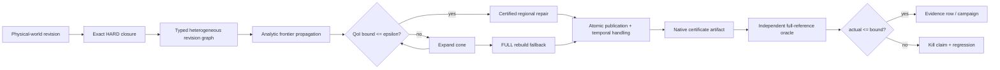

# MAVEB / AETHER

> **Dependency-certified minimal-work repair for persistent captured worlds, implemented inside a Metal-native reconstruction and rendering research engine.**

[](https://github.com/swayam8624/Maveb/actions/workflows/ci.yml)
[](https://github.com/swayam8624/Maveb/actions/workflows/studio-compile.yml)
[](https://github.com/swayam8624/Maveb/actions/workflows/apple-silicon-gpu.yml)


MAVEB is the research project. **AETHER** is the engine and captured-world systems stack used to test it.

The central research question is simple to state and difficult to make safe:

> **When a small part of a persistent captured world changes, how little work can we redo without silently changing the final output beyond a declared tolerance?**

A full rebuild is safe but expensive. A local heuristic is cheap but can miss hidden dependencies. MAVEB's proposed contribution is **Criticality-Bounded Revision Cones (CBRC)**: a fail-closed planner that mixes exact structural closure with conservative analytic change bounds and automatically falls back to a full rebuild when locality cannot be certified.

> [!IMPORTANT]
> **CBRC v1 implementation and the frozen real-scene evidence campaign are complete.**
> The public v2.1 campaign contains 60 frozen revisions across four real RGB/SfM scenes: 44 certified-local repairs, 16 automatic FULL fallbacks, and zero observed certificate violations. A secondary public trained-3DGS campaign also passes the same certificate/oracle contract. Reported work reductions are not relabeled as end-to-end speedup.

---

## The problem

Persistent captured worlds are not one representation. A physical edit can propagate through a heterogeneous stack:

- observations and provenance;
- sparse TSDF state;
- mesh ownership and topology;
- texture pages and material state;
- Gaussian primitives;
- GPU publication buffers;
- temporal history;
- final rendered quantities of interest.

That creates an uncomfortable tradeoff.

| Strategy | Safety | Work | Main failure mode |
|---|---|---:|---|
| Full rebuild | Strong | High | Recomputes unaffected state |
| Fixed spatial radius | Heuristic | Often low | Misses non-local dependencies |
| Changed-fraction threshold | Heuristic | Low | Ignores coupling structure |
| Empirical influence model | Predictive | Variable | Prediction is not a certificate |
| **CBRC** | **Fail-closed certificate** | **Adaptive** | Falls back to FULL when a safe local cone cannot be justified |

The target is not "always incremental." The target is:

> **Use a smaller repair cone only when the unrepaired exterior is conservatively bounded for the declared output. Otherwise rebuild.**

---

## Proposed novel solution: Criticality-Bounded Revision Cones

CBRC models one world revision as a typed dependency graph.

Each dependency is one of:

- **HARD** — exact identity, topology, ownership, provenance, publication, or invalidation dependency;
- **ANALYTIC** — a conservative finite-change upper bound with explicit provenance;
- **EMPIRICAL** — useful for scheduling experiments, but never trusted as a certificate.

For a candidate repair cone (C), CBRC asks whether every declared quantity of interest can satisfy:

```
certified_bound(C) <= epsilon
```

while exact dependencies remain closed. If yes, the cone is feasible. If not, the planner expands the cone or chooses the full reference rebuild.

The implementation also checks the emitted certificate against an independent full-reference replay:

```
measured_full_reference_error <= certified_bound <= epsilon
```

Any observed `actual > bound` is a correctness failure, not a noisy data point.

### Why this angle matters

The graph traversal itself is not the research novelty. Classical closure, resolvents, and sensitivity propagation already exist.

The proposed contribution is the **captured-world specialization and end-to-end systems contract**:

1. exact and analytic dependencies coexist in one heterogeneous revision graph;
2. only implementation-backed conservative bounds are certificate-eligible;
3. the repair objective is tied to explicit output QoIs rather than generic "change";
4. unsupported cycles and uncertain dependencies fail closed;
5. heterogeneous work is compared through a frozen versioned cost model rather than by adding incompatible counters;
6. every decision is serialized into machine-readable provenance and replayed against an independent full reference.

Novelty remains a research claim to be tested against prior art and peer review, not something the README can prove by assertion.

---


## Mathematics behind CBRC

CBRC is not based on a fixed spatial radius. It treats a captured world as a **typed dependency system** and asks a mathematical question:

> if we repair only a subset of the changed dependency graph, can we upper-bound the error left outside that repair set below the requested tolerance?

The notation below matches the reference implementation in `research/cbrc/core.py`.

### 1. State graph and repair cone

Let the captured-world dependency graph contain state blocks

$$
V = \{1,\ldots,n\}.
$$

A state block can represent an observation region, TSDF block, mesh patch, texture page, material state, Gaussian subset, GPU publication region, temporal-history region, or another derived unit.

For one physical-world revision, CBRC chooses a **repair cone**

$$
C \subseteq V
$$

and calls the unrepaired state the **exterior**

$$
O = V \setminus C.
$$

HARD dependencies are exact. If node $v$ is repaired and $u$ is an exact predecessor required to reproduce $v$, then $u$ must also be repaired. Therefore an admissible cone must satisfy exact predecessor closure:

$$
v\in C,\; u\in\operatorname{Pred}_{\mathrm{HARD}}(v)
\quad\Longrightarrow\quad
u\in C.
$$

This is why CBRC cannot simply select whichever nodes look cheap: the candidate cone must first be structurally valid.

### 2. Conservative influence matrix

For ANALYTIC dependencies, define a componentwise non-negative matrix

$$
K \in \mathbb{R}_{\ge 0}^{n\times n},
$$

where

$$
K_{vu}
$$

is a conservative upper bound on how much normalized change in state block $u$ can influence state block $v$.

Only conservative, implementation-backed bounds are permitted in the certificate matrix. Learned or empirical influence estimates can help schedule experiments, but they do **not** enter the safety proof.

Let

$$
b\in\mathbb{R}_{\ge0}^{n}
$$

be the direct source-change envelope produced by the physical revision, and let

$$
z\in\mathbb{R}_{\ge0}^{n}
$$

contain known change bounds for repaired state.

For the unrepaired exterior, conservative propagation satisfies

$$
\delta_O
\;\le\;
b_O + K_{OC}z_C + K_{OO}\delta_O.
$$

The first term is direct change reaching the exterior, the second is influence crossing from repaired state into unrepaired state, and the third is repeated propagation entirely inside the unrepaired exterior.

### 3. Resolvent certificate

If the exterior feedback is stable,

$$
\rho(K_{OO}) < 1,
$$

where $\rho$ is the spectral radius, then

$$
(I-K_{OO})^{-1}
=
I + K_{OO} + K_{OO}^2 + \cdots
$$

exists and is componentwise non-negative for the certified system.

Define

$$
G_O = (I-K_{OO})^{-1}.
$$

Then CBRC obtains a finite conservative exterior envelope

$$
\boxed{
\hat\delta_O
=
G_O\left(b_O + K_{OC}z_C\right)
}
$$

such that the true unrepaired change is bounded componentwise by

$$
\delta_O \le \hat\delta_O.
$$

This equation is the mathematical core of the certificate: it accounts not only for one-hop influence, but also for arbitrarily many stable dependency-propagation steps in the unrepaired exterior.

If the exterior cannot be certified—for example $\rho(K_{OO})\ge1$, the analytic assumptions are unsupported, or the graph contains an unsupported analytic cycle—CBRC **fails closed**. It expands $C$, converts the unsafe dependency to exact work, or falls back to a full rebuild.

### 4. Quantity-of-interest error bound

A user does not usually care about abstract state error; they care about an output such as protected RGB pixels, geometry, or another declared quantity of interest (QoI).

For QoI $q$, let

$$
R_q
$$

map state perturbations to that output and let the allowed tolerance be

$$
\varepsilon_q \ge 0.
$$

Because the state envelope is componentwise non-negative, CBRC conservatively evaluates

$$
\boxed{
B_q(C)
=
\left\|
|R_{q,O}|\hat\delta_O
\right\|_\infty
}
$$

and accepts the cone only when

$$
B_q(C)\le\varepsilon_q
\qquad\text{for every declared QoI }q.
$$

The complete safety contract used by the experiment harness is stronger:

$$
\boxed{
E_q^{\mathrm{full-ref}}
\le
B_q(C)
\le
\varepsilon_q
}
$$

where $E_q^{\mathrm{full-ref}}$ is the error measured against an independently replayed full-reference result. If measured error ever exceeds the certificate, that case is a correctness failure.

### 5. Gaussian rendering bound

For a projected Gaussian at pixel $p$, MAVEB uses the renderer-compatible effective alpha model

$$
\alpha_i(p)
=
o_i\exp\left(-\frac12 q_i(p)\right),
$$

where $o_i$ is peak opacity and $q_i(p)$ is squared Mahalanobis distance in projected Gaussian space. The implementation also mirrors the production compositor's cutoff/clamping rules.

For an edited set $E$, define its aggregate opacity mass

$$
A(E)
=
1-\prod_{i\in E}(1-\alpha_i).
$$

If every relevant color channel lies in an interval of width $C_{\mathrm{color}}$, inserting/removing that edited subset changes one rendered channel by at most

$$
\left\|R(U\cup E)-R(U)\right\|_\infty
\le
C_{\mathrm{color}}A(E).
$$

For before/after edited states $E_0,E_1$,

$$
\boxed{
\left\|R(U\cup E_0)-R(U\cup E_1)\right\|_\infty
\le
C_{\mathrm{color}}
\min\left(1,A(E_0)+A(E_1)\right)
}
$$

and over a protected camera/pixel set $P$,

$$
B_P
=
\max_{p\in P}
C_{\mathrm{color}}
\min\left(1,A_{0,p}+A_{1,p}\right).
$$

This is what lets a Gaussian edit become an **explicit display-space error certificate** rather than merely a heuristic "local update."

### 6. Temporal-history bound

When temporal validation remains stable, let

- $E_c$ be current-frame error,
- $E_h$ be retained-history error,
- $E_n$ be neighborhood-extrema/clamping error,
- $w\in[0,1]$ be history weight.

The retained history envelope is

$$
E_r = \max(E_h,E_n),
$$

and the resolved temporal output is bounded by

$$
\boxed{
E_{\mathrm{resolved}}
=
(1-w)E_c + wE_r.
}
$$

If the validation/disocclusion decision itself may change, MAVEB does not pretend this soft equation is sufficient: that dependency becomes HARD and the affected history is invalidated.

For stable repeated history reuse, an initial history error also decays geometrically:

$$
E_t \le E_0 w^t.
$$

### 7. Heterogeneous work model

The system deliberately does **not** add incompatible counters such as TSDF blocks + pixels + bytes + Gaussians.

For each work domain $d$, let

- $n_d(C)$ be native work performed by cone $C$,
- $\kappa_d$ be a frozen pre-calibrated cost per native unit.

The planner's scalar comparison is

$$
\boxed{
W(C)
=
\sum_d \kappa_d\,n_d(C).
}
$$

The full-reference baseline is independently measured as

$$
W_{\mathrm{full}}.
$$

A certified local cone is useful only when

$$
W(C)<W_{\mathrm{full}}.
$$

The coefficients $\kappa_d$ are frozen **before** the final campaign so the cost model cannot be tuned after seeing the desired result.

### 8. Greedy cone expansion

CBRC v1 solves for a certified **feasible** cone, not the globally optimal combinatorial cone.

Define normalized certificate violation

$$
\phi(C)
=
\max_q
\frac{B_q(C)}{\max(\varepsilon_q,\epsilon_{\mathrm{num}})}.
$$

A passing cone has

$$
\phi(C)\le1.
$$

For a candidate expansion $C\rightarrow C'$, the greedy planner prefers high reduction in violation per added calibrated work:

$$
\text{utility}(C\rightarrow C')
=
\frac{\phi(C)-\phi(C')}
{W(C')-W(C)}.
$$

Every candidate is first closed over HARD predecessors, re-certified, and compared against the independent full-work baseline. If no smaller safe cone remains worthwhile, CBRC returns FULL.

### 9. Diagnostics: susceptibility and effectivity

Two useful diagnostics are retained without confusing them with the proof itself.

Exterior susceptibility is

$$
S_O
=
\left\|
(I-K_{OO})^{-1}
\right\|_1,
$$

which indicates how strongly exterior dependencies can amplify perturbations.

Certificate effectivity is

$$
\eta
=
\frac{B_q(C)}
{\max(E_q^{\mathrm{full-ref}},\epsilon_{\mathrm{num}})}.
$$

A valid certificate requires $\eta\ge1$; values close to $1$ are tight, while very large values are safe but potentially too conservative to be useful.

The implementation corresponding to these equations lives in:

- `research/cbrc/core.py` — cone certification, resolvent, QoI bounds and greedy search;
- `research/cbrc/layer_bounds.py` — Gaussian and temporal analytic bounds;
- `research/cbrc/work.py` — frozen heterogeneous work-cost model;
- `engine/revision/` — sparse native C++ planner;
- `research/theory/alpha_locality_bound.md` — Gaussian compositing derivation.

---

## Architecture



### V1 dependency boundary

**Analytic soft bounds**

- Gaussian revision → current-image RGB L∞ bound;
- stable temporal history/current image → resolved-image bound.

**Exact HARD dependencies by design**

- observation → TSDF;
- TSDF → mesh ownership/support;
- mesh → texture-page identity;
- texture page → material-state identity;
- Gaussian source record → GPU publication;
- unstable temporal validation / disocclusion.

Those HARD edges are not unfinished approximation work. V1 intentionally refuses to weaken dependencies without a useful conservative theorem.

---

## What is implemented

| Layer | Status |
|---|---|
| Dense Python reference planner | ✅ complete |
| Sparse C++23 planner | ✅ complete |
| HARD / ANALYTIC / EMPIRICAL edge semantics | ✅ complete |
| Greedy certified cone search | ✅ complete |
| FULL rebuild fallback | ✅ complete |
| Gaussian image certificate | ✅ complete |
| Temporal certificate / hard invalidation | ✅ complete |
| Observation→TSDF→mesh→texture/material graph | ✅ complete |
| Gaussian→GPU publication graph | ✅ complete |
| Heterogeneous `LocalityLedger` accounting | ✅ complete |
| Frozen scalar work-cost model | ✅ complete |
| Indexed persistent Gaussian edits | ✅ complete |
| Immutable revision sidecars | ✅ complete |
| Native deterministic certificate JSON | ✅ complete |
| Headless revision tool | ✅ complete |
| Independent Gaussian full-reference oracle | ✅ complete |
| Replay + strict evaluator | ✅ complete |
| Evidence bundle hashing | ✅ complete |
| Native ↔ Python planner parity gate | ✅ complete |
| Baselines + ablations | ✅ complete |
| Real-campaign automation | ✅ complete |
| F1–F8 paper-artifact generation | ✅ complete |
| CPU / sanitizer / static-analysis / app CI | ✅ complete |
| Frozen public real-scene campaign v2.1 | ✅ 60 cases / 4 scenes; 44 local, 16 FULL; 0 certificate violations |
| Public trained-3DGS validation | ✅ 5 cases; 4 local, 1 FULL; 0 certificate violations |
| Frozen calibrated heterogeneous-work evidence | ✅ complete |
| End-to-end local-vs-FULL wall-clock speedup claim | intentionally not claimed without a paired timing experiment |

See [the exact v1 boundary](research/design/CBRC_IMPLEMENTATION_STATUS.md).

---

## Frozen measured evidence

The paper-grade v2.1 public campaign freezes **60 revisions across four public RGB/SfM scenes** before outcomes are inspected.

| Evidence | Measured result |
|---|---:|
| Frozen revisions | 60 |
| Public scenes | 4 |
| Certified-local selections | 44 |
| Automatic FULL fallbacks | 16 |
| Certificate violations | 0 |
| Native ↔ Python planner parity | 60 / 60 |
| Median calibrated heterogeneous work / FULL | 0.349 |
| Median calibrated work reduction factor | 2.87× |
| Source edits visibly exceeding the protected RGB tolerance | 56 / 60 |

The calibrated public-campaign work model uses frozen isolated microbenchmarks in milliseconds. **2.87× is therefore a calibrated work-reduction factor, not a measured end-to-end speedup.** The campaign also exposes an important systems limitation: median Gaussian inspection remains approximately the full set even though Gaussian updates/publication and temporal invalidation are much smaller.

A secondary campaign uses a pinned **public trained 3DGS PLY** while preserving SH coefficients, opacity, anisotropic scale and rotation. It records **4/5 certified-local cases, 1/5 FULL fallback, and zero certificate violations**. Its median selected native temporal/output work is 0.03495 of FULL (about 28.6× lower native work), again **not wall-clock speedup**.

The separate sparse-discovery sweep preserves exact selection while reducing inspection to a median 1% of a full scan (minimum 0.1% through 1M Gaussians). That result shows a path to removing the current near-full-inspection bottleneck; it is reported separately because the frozen end-to-end public campaign has not yet integrated that optimization into its measured work ledger.

The canonical machine-readable evidence snapshot is maintained under `research/results/`.

---

## Research funnel

MAVEB did not start by coding a favorite idea.

The committed hypothesis bank contains **119 candidates**. The final filter froze the current paper line into:

- **5 locked headline hypotheses**;
- **16 required mechanisms**;
- **6 evaluation / ablation hypotheses**;
- **92 deferred follow-ups**.

The locked problem is:

> **Dependency-certified heterogeneous minimal-work repair for persistent captured worlds.**

The policy is intentionally adversarial: cheapest falsification first; kill or defer ideas when prior art, probes, held-out scenes, or ablations remove the claimed effect.

Start at [research/README.md](research/README.md).

---

## Expected impact

If the certificate remains useful on real scenes, the practical impact is broader than one renderer.

### Persistent XR and digital twins

A local physical edit should not force an entire room, site, or digital twin to be reconstructed and republished when most state is provably irrelevant to the requested output.

### Incremental reconstruction systems

CBRC provides a common decision layer over representations that normally have separate invalidation rules: TSDF, meshes, textures, Gaussians, GPU resources, and temporal state.

### Safer performance optimization

Instead of saying "this update probably stays local," the system emits the assumptions, cone, bound, cost model, fallback decision, and replay evidence that justify the optimization.

### Research reproducibility

A failed certificate is preserved as an artifact and becomes a regression. The project is designed so a negative result is useful rather than something to hide.

> [!NOTE]
> These remain **potential impacts** beyond the evaluated workloads. The frozen campaigns establish certificate behavior and measured/calibrated work on the stated representations; they do not establish a universal or end-to-end wall-clock speedup claim.

---

## Engine and systems stack

AETHER provides the experimental substrate:

- C++23 core with structured errors, profiling and deterministic resource handling;
- Metal renderer with bounded frames in flight and offline metallib compilation;
- SwiftUI macOS AetherStudio with an Objective-C++ bridge;
- Swift 6 iPad RGB + LiDAR capture companion;
- versioned `.aether` package format;
- canonical textured GLB export;
- standard 3D Gaussian Splatting PLY ingestion;
- CPU reference Gaussian rasterizer plus Metal 3 Gaussian path;
- reverse-Z proxy mesh G-buffer and Gaussian occlusion;
- glTF metallic-roughness material path;
- deterministic sparse CPU/Metal TSDF infrastructure;
- halo-consistent incremental CPU meshing;
- persistent-world revisions and locality evidence;
- [MavebBench](benchmarks/README.md) real-data evidence harness.

<details>
<summary><strong>What the repository deliberately does not claim</strong></summary>

- CBRC v1 is not a proof of global minimum-work optimality; the current search is greedy.
- Empirical Jacobians and learned sensitivities are not certificates.
- Unsupported analytic cycles are not assumed safe.
- Synthetic matrices do not establish real-world speedup.
- A full rebuild can be the correct answer for globally coupled edits.
- GPU-resident meshing and some broader production reconstruction gates remain separate roadmap items.
- Publication claims are restricted to the frozen measured campaigns and their stated provenance; the project does not convert calibrated work into an end-to-end speedup claim.

See [CBRC limitations and threat model](research/design/CBRC_LIMITATIONS.md).

</details>

---


## Clone and run

### Fastest path

On an Apple-silicon Mac with Xcode installed:

```bash
git clone https://github.com/swayam8624/Maveb.git
cd Maveb
chmod +x bootstrap_and_run.sh run_all.sh
./bootstrap_and_run.sh
```

That command validates the machine, prepares Python dependencies, configures and builds the CI and sanitizer targets, compiles AetherStudio, executes CTest and Python tests, runs the randomized CBRC falsification test, and produces the synthetic CBRC pilot artifacts.

To compile, validate, and then launch AetherStudio:

```bash
./bootstrap_and_run.sh --launch-studio
```

To let the bootstrap script install missing Homebrew packages such as CMake and Ninja:

```bash
./bootstrap_and_run.sh --install-deps
```

To execute a frozen **real** CBRC campaign in the same run:

```bash
MAVEB_CAMPAIGN=/absolute/path/campaign.json \
MAVEB_WORK_COST=/absolute/path/frozen-work-cost.json \
./bootstrap_and_run.sh
```

The real campaign is never faked when those external scene archives/sidecars are absent; the script reports it as pending and still completes all repository-contained validation.

### Paper-grade research campaign and SIGGRAPH visual package

After the five-case public pilot is green, the repository can execute the larger
frozen research package without private data:

```bash
./run_public_real_campaign_v2.sh
```

Campaign-v2 expands the public matrix to four RGB/SfM scenes and 15 deterministic
revision templates per scene (60 frozen cases). The matrix spans edit magnitude,
entity size, temporal history weight, epsilon, stable/unstable temporal history,
and low/medium/high/adversarial coupling labels. Cases are copied and hashed
before outcomes are read; the runner must not delete or retune cases after seeing
results.

The v2 runner also:

- freezes an isolated hardware-derived millisecond cost model for
  `gaussiansInspected`, `gaussiansUpdated`, `gpuPublicationBytes`, and
  `temporalPixelsInvalidated`;
- records measured campaign phase wall times separately from the calibrated cost
  estimate;
- sweeps scan-vs-index candidate discovery from 10k to 1M Gaussians;
- evaluates a fixed held-out empirical changed-fraction heuristic;
- runs FULL, EXACT, radius, fraction, empirical-scheduling and CBRC baselines plus
  required ablations;
- generates the standard paper CSV/SVG artifacts and a reproducible visual package;
- audits evidence completeness without predicting venue acceptance.

The calibrated work model is **not** automatically an end-to-end runtime
speedup. Phase wall-clock measurements and the isolated cost model are reported
as different quantities.

For a secondary representation check, MAVEB can fetch a public trained 3DGS PLY,
preserve its SH/opacity/anisotropic scale/rotation fields, seed persistent spatial
ownership, and execute the same certificate/oracle contract:

```bash
./run_trained_3dgs_campaign.sh
```

This trained-3DGS path is deliberately labeled as spatial ownership rather than
semantic segmentation. If its source does not provide trustworthy metric scale,
the seeder canonicalizes scene scale and records that provenance.

To execute the full research package in sequence:

```bash
./run_paper_grade_research.sh
```

Key outputs:

```text
build/public-real-v2/
├── calibration/work-cost-model.json
├── sparse-discovery/F11_sparse_discovery.svg
├── frozen-inputs/campaign-v2.json
├── frozen-inputs/campaign-v2-freeze.json
├── campaign/campaign-rows.jsonl
├── campaign/campaign-timings.jsonl
├── campaign/empirical-heldout.json
├── campaign/paper-artifacts/
├── siggraph-visuals/
│   ├── figures/F0_hero.png
│   ├── figures/F0_system_overview.svg
│   ├── figures/F9_evidence_dashboard.png
│   ├── figures/F10_case_mosaic.png
│   └── video/
│       ├── MAVEB_teaser.gif
│       └── MAVEB_supplementary_cases.gif
└── PAPER_GRADE_STATUS.json

build/trained-3dgs-campaign/
├── source/TRAINED_3DGS_SOURCE.json
├── campaign/
├── siggraph-visuals/
└── TRAINED_3DGS_STATUS.json

build/paper-grade-final/
├── representation/F12_representation_comparison.svg
└── PAPER_GRADE_STATUS.json
```

The visual system never redraws or beautifies scientific evidence by hand.
Before/FULL-after/selected-repair/support/effect/residual frames come from the
independent oracle, while labels and numbers are read from frozen campaign
artifacts. The complete figure/video storyboard is in
`research/visualization/SIGGRAPH_VISUAL_STORYBOARD.md`.

### Zero-input public real campaign (recommended)

MAVEB does **not** require LiDAR or private data for its canonical research path. The default
reproducible real-world experiment downloads the public GraphDECO COLMAP-ready Tanks & Temples
bundle and uses only the Tanks & Temples **Train** and **Truck** scenes:

```bash
chmod +x run_public_real_campaign.sh
./run_public_real_campaign.sh
```

No file from the user is required. The pipeline performs:

```text
official public ordinary-RGB dataset
    -> pinned HTTPS archive + SHA-256 verification
    -> COLMAP sparse SfM points/colors
    -> deterministic quality filtering
    -> explicit canonical scene-scale normalization
    -> isotropic Gaussian seed field
    -> deterministic spatial persistent ownership
    -> two native .aetherworld scenes
    -> five frozen real revision cases
    -> production CBRC planner
    -> independent full-reference oracle
    -> FULL / EXACT / RADIUS / FRACTION / EMPIRICAL baselines
    -> required ablations + native/Python parity
    -> paper artifacts + answer-first evidence report
```

The source archive is pinned in
`research/config/cbrc_public_real_sources.json`. The primary public campaign extracts only the
Tanks & Temples members, whose dataset license is CC BY 4.0. The archive is downloaded from
GraphDECO's official 3D Gaussian Splatting dataset endpoint.

COLMAP monocular SfM does not recover an absolute metric scale by itself. MAVEB therefore records
`scaleSource = canonical-normalization-not-measured` and must **not** describe this public path as
metric-scale reconstruction. Likewise, these are real RGB-derived SfM points initialized as
isotropic Gaussians, not trained photorealistic 3DGS. Those boundaries are written into every
world's provenance sidecar.

Outputs:

```text
build/public-real-campaign/
├── source/PUBLIC_SOURCE_PROVENANCE.json
├── worlds/
│   ├── tandt-train.aetherworld
│   ├── tandt-train.aetherworld.gaussians.r1.bin
│   ├── tandt-train.aetherworld.ownership.r1.bin
│   ├── tandt-train.aetherworld.source.json
│   ├── tandt-truck.aetherworld
│   └── ...
├── frozen-inputs/
│   ├── campaign.json
│   └── campaign-freeze.json
└── campaign/
    ├── campaign-gates.json
    ├── baseline-summary.json
    ├── REAL_CAMPAIGN_ANSWER.md
    └── paper-artifacts/
```

If the official archive is already cached somewhere, avoid another download with:

```bash
MAVEB_PUBLIC_ARCHIVE=/absolute/path/tandt_db.zip ./run_public_real_campaign.sh
```

### No real world yet: capture one

If you do not already have a `.aetherworld` with Gaussian/ownership sidecars, create the first real
benchmark directly from a MavebCapture LiDAR scan.

1. Record a real scene with the iPadOS `MavebCapture` app and export the complete
   `Scan.mavebcapture` directory to the Mac.
2. Run:

```bash
chmod +x capture_to_real_campaign.sh
./capture_to_real_campaign.sh /absolute/path/Scan.mavebcapture
```

The pipeline performs:

```text
real ARKit RGB-D/LiDAR capture
    -> hash-validated replay
    -> metric TSDF fusion
    -> real proxy mesh
    -> deterministic isotropic Gaussian seed field
    -> spatial persistent entities / ownership
    -> WORLD.aetherworld
    -> WORLD.aetherworld.gaussians.r1.bin
    -> WORLD.aetherworld.ownership.r1.bin
    -> frozen CBRC real campaign
    -> independent full-reference oracle
    -> baselines + ablations + paper artifacts
```

Final outputs are written below `build/real-capture-bootstrap/`, including:

```text
real-proxy.ply
real-seeded.aetherworld
real-seeded.aetherworld.gaussians.r1.bin
real-seeded.aetherworld.ownership.r1.bin
cbrc/campaign/REAL_CAMPAIGN_ANSWER.md
cbrc/campaign/paper-artifacts/
```

The seed path is deliberately labeled
`deterministic-spatial-grid-not-semantic`: ownership cells are deterministic spatial partitions,
not semantic object segmentation. Likewise, the Gaussian field is initialized from real fused
surface samples with isotropic kernels; it is valid real captured geometry for testing CBRC
locality/certification, but it must not be described as a trained photorealistic 3DGS model.
A later publication-strength campaign can replace the seeded field with trained Gaussians without
changing the CBRC evidence machinery.

### Real campaign autopilot

After the repository-contained verifier passes, the fastest real-data path is:

```bash
./run_real_campaign.sh
```

The autopilot searches the repository plus `~/Desktop`, `~/Documents`, and `~/Downloads` for complete real persistent worlds. A candidate is accepted only when the latest world revision has both immutable sidecars:

```text
WORLD.aetherworld
WORLD.aetherworld.gaussians.rR.bin
WORLD.aetherworld.ownership.rR.bin
```

For accepted real worlds it deterministically derives a framing camera, selects a meaningfully local owned entity, makes five independent before-state copies, freezes low/medium/high/adversarial edits before reading results, runs the independent full-reference oracle, baselines, ablations and parity gates, and writes an answer-first report at:

```text
build/research-real/campaign/REAL_CAMPAIGN_ANSWER.md
```

To point directly at a known archive:

```bash
MAVEB_REAL_ARCHIVE=/absolute/path/world.aetherworld ./run_real_campaign.sh
```

A frozen heterogeneous millisecond cost model can still be supplied with `MAVEB_WORK_COST`. Without one, the headless real campaign uses the production planner's single-domain temporal-pixel work and reports native per-domain ratios separately; it does **not** mislabel those numbers as heterogeneous wall-clock speedup.

### Manual equivalent

```bash
git clone https://github.com/swayam8624/Maveb.git
cd Maveb

cmake --preset ci
cmake --build --preset ci --parallel
ctest --preset ci

cmake --preset sanitizer
cmake --build --preset sanitizer --parallel
ctest --test-dir build/sanitizer --output-on-failure

cmake --preset debug -DAETHER_REQUIRE_METAL_TOOLCHAIN=OFF
cmake --build --preset debug --target AetherStudio --parallel

python3 -m venv .venv-maveb
.venv-maveb/bin/python -m pip install --upgrade pip
.venv-maveb/bin/python -m pip install numpy pillow scipy
.venv-maveb/bin/python -m unittest discover -s benchmarks/tests -p 'test_*.py'
.venv-maveb/bin/python -m unittest discover -s research/tests -p 'test_*.py'

.venv-maveb/bin/python research/experiments/cbrc_gaussian_temporal_chain.py \
  --seed 20260920 --trials 100000

.venv-maveb/bin/python research/experiments/cbrc_synthetic_benchmark.py \
  --out build/research-final/cbrc-synthetic-pilot.jsonl \
  --seed 20260920 --repeats 1 --pilot
```

---

## Build

### Requirements

- Git;
- Apple-silicon Mac;
- macOS 15 or newer;
- Xcode 26 or newer;
- CMake 3.28 or newer;
- Ninja;
- Python 3 with `venv` support;
- separately downloadable Xcode Metal Toolchain for full Metal compilation.

`bootstrap_and_run.sh --install-deps` can install missing Homebrew `cmake`, `ninja`, and `python` packages and request the Metal Toolchain. It deliberately does not install Homebrew or Xcode itself.

Install the Metal compiler if needed:

```bash
xcodebuild -downloadComponent metalToolchain
```

### If `xcode-select` points to CommandLineTools

A common macOS setup has the standalone Command Line Tools selected even though full Xcode is installed:

```text
xcode-select: error: tool 'xcodebuild' requires Xcode, but active developer directory
'/Library/Developer/CommandLineTools' is a command line tools instance
```

For the current shell, prefer:

```bash
export DEVELOPER_DIR=/Applications/Xcode.app/Contents/Developer
xcodebuild -version
```

Or switch the machine-wide developer directory:

```bash
sudo xcode-select --switch /Applications/Xcode.app/Contents/Developer
```

If Xcode has just been installed, open it once or complete first-launch setup:

```bash
sudo xcodebuild -runFirstLaunch
```

The MAVEB bootstrap now detects a usable full Xcode installation under `/Applications` and sets `DEVELOPER_DIR` for its own process automatically, so a globally selected Command Line Tools directory no longer blocks the run.

### One-command verification

For a first run after cloning, use:

```bash
./bootstrap_and_run.sh
```

The bootstrap validates the supported Mac/Xcode/CMake environment, initializes submodules, creates an isolated Python virtual environment, installs the Python benchmark dependencies, and then invokes the complete verifier.

For later runs inside an already prepared clone:

```bash
./run_all.sh
```

`run_all.sh` performs the warnings-as-errors CI build/tests, sanitizer build/tests, AetherStudio compile, Python benchmark/research tests, 100,000 randomized certificate falsification trials, the synthetic CBRC pilot, native-tool smoke validation, and—when supplied—the frozen real campaign. Use `./run_all.sh --help` for environment variables and launch options.

### Development build

```bash
cmake --preset debug
cmake --build --preset debug
ctest --preset debug
open build/debug/apps/AetherStudio/AetherStudio.app
```

### CI-equivalent CPU build

```bash
cmake --preset ci
cmake --build --preset ci
ctest --preset ci
```

### Sanitizers

```bash
cmake --preset sanitizer
cmake --build --preset sanitizer
ctest --test-dir build/sanitizer --output-on-failure
```

---

## Run one certified revision

```bash
build/ci/tools/maveb-cbrc-revision/maveb-cbrc-revision \
  --archive /absolute/path/world.aetherworld \
  --entity 42 \
  --target 0.05,0.0,0.0 \
  --timestamp 1000000001 \
  --output-dir /tmp/cbrc-case \
  --width 1280 --height 720 \
  --focal-x 900 --focal-y 900 \
  --center-x 640 --center-y 360 \
  --epsilon 0.01
```

The headless path writes:

- `translation.json`;
- `certificate.json`;
- `native-planner-certificate.json`;
- new immutable Gaussian and ownership revision sidecars.

See [the full CBRC guide](docs/research/CBRC.md).

---

## Run the frozen real campaign

Start from [the campaign template](research/config/cbrc_real_campaign.example.json), freeze hardware work coefficients, then run:

```bash
python3 benchmarks/scripts/cbrc_campaign.py \
  --campaign /absolute/path/campaign.json \
  --oracle build/ci/tools/maveb-cbrc-gaussian-oracle/maveb-cbrc-gaussian-oracle \
  --revision-tool build/ci/tools/maveb-cbrc-revision/maveb-cbrc-revision \
  --git-sha "$(git rev-parse HEAD)" \
  --output-dir /absolute/path/cbrc-results
```

Default campaign gates require:

- a minimum revision count;
- at least one certified local case;
- at least one high/adversarial-coupling case;
- at least one automatic FULL fallback;
- zero certificate violations;
- native/Python planner parity.

Full procedure: [CBRC experiment runbook](research/results/CBRC_EXPERIMENT_RUNBOOK.md).

---

## Repository map

| Path | Purpose |
|---|---|
| [`engine/revision/`](engine/revision/) | Native typed revision graph and CBRC planner |
| [`engine/cbrc/`](engine/cbrc/) | Captured-world heterogeneous graph adapter |
| [`engine/world_gaussian/`](engine/world_gaussian/) | Gaussian ownership, locality and image certificates |
| [`engine/scene/`](engine/scene/) | Temporal revision certificate |
| [`engine/world/`](engine/world/) | Persistent-world and locality ledger |
| [`research/`](research/) | Hypotheses, theory, falsification, analysis and schemas |
| [`benchmarks/`](benchmarks/) | Real-data reconstruction and CBRC evidence campaigns |
| [`tools/maveb-cbrc-revision/`](tools/maveb-cbrc-revision/) | Headless persistent revision capture |
| [`tools/maveb-cbrc-gaussian-oracle/`](tools/maveb-cbrc-gaussian-oracle/) | Independent full-reference image oracle |
| [`apps/AetherStudio/`](apps/AetherStudio/) | macOS interactive application |
| [`apps/MavebCapture/`](apps/MavebCapture/) | iPad RGB + LiDAR capture companion |

---

## Documentation

**Research**

- [Research hub](research/README.md)
- [CBRC architecture and operator guide](docs/research/CBRC.md)
- [Implementation status](research/design/CBRC_IMPLEMENTATION_STATUS.md)
- [Limitations and threat model](research/design/CBRC_LIMITATIONS.md)
- [Frozen paper claim ledger](research/results/CBRC_CLAIM_LEDGER_2026-09-21.md)
- [Cross-representation validation figure](research/results/F12_representation_comparison_2026-09-21.svg)
- [Result schema](research/results/CBRC_RESULT_SCHEMA.md)
- [Experiment runbook](research/results/CBRC_EXPERIMENT_RUNBOOK.md)
- [Machine-readable schemas](research/schema/README.md)

**Engine / formats**

- [Roadmap](docs/ROADMAP.md)
- [Benchmark contract](docs/BENCHMARKING.md)
- [AETHER package format](docs/formats/AETHER_PACKAGE.md)
- [Canonical Asset v1](docs/formats/CANONICAL_ASSET.md)
- [Native GLB export](docs/formats/NATIVE_GLB_EXPORT.md)
- [Gaussian PLY profile](docs/formats/GAUSSIAN_PLY.md)
- [Reconstruction truth ADR](docs/adr/0005-reconstruction-truth-and-oracle-first.md)

---

## Evidence philosophy

> [!CAUTION]
> A certificate violation is never averaged away.

Every certified result must satisfy:

```
measured_full_reference_error <= certified_bound <= epsilon
```

Every result archive should retain the exact git SHA, graph/bound/cost-model versions, input revisions, camera, chosen cone, full-reference output, raw heterogeneous work counters, and failed artifacts.

That is the standard the project uses before paper prose is allowed to become a performance claim.

---

## Repository history

The original Metal learning tree is preserved on `archive/metal-practice-2026-07-12`. The maintained tutorial starts under `examples/00_triangle`.

Historical research branches are provenance-only working lines. **`main` is the canonical MAVEB/CBRC project branch.**

---

## License

AETHER/MAVEB source code is licensed under Apache-2.0. Documentation is licensed under CC BY 4.0 unless a file states otherwise. Datasets and third-party assets keep their original licenses and are never implicitly covered by the source license.
