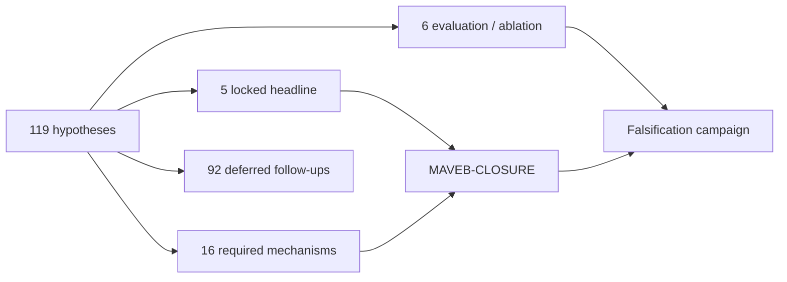
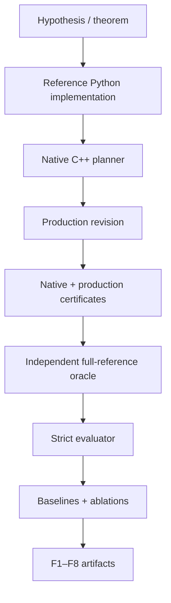

# MAVEB Research

> **Locked problem:** dependency-certified heterogeneous minimal-work repair for persistent captured worlds.

This directory contains the scientific contract behind MAVEB rather than a collection of disconnected experiments.

The current paper line is **MAVEB-CLOSURE**, implemented as **Criticality-Bounded Revision Cones (CBRC)**.

## Research funnel

The hypothesis bank contains **119 records**.



The filter rule is:

> Only hypotheses that directly prove, implement, or falsify the locked claim remain active for the current paper.

Nothing in the bank is a novelty proof. Prior-art collision, failed probes, held-out failures, or a useless novel-component ablation are valid reasons to kill or defer an idea.

## Problem statement

A persistent captured world may simultaneously contain observations, TSDF state, meshes, textures, materials, Gaussian primitives, GPU publication resources and temporal history.

A local physical edit therefore does not imply local computational impact.

The safe baseline is a full rebuild. The cheap baseline is a heuristic local update. MAVEB asks whether we can obtain a third option:

> **A smaller repair cone whose unrepaired exterior is conservatively certified for a declared output tolerance.**

## Proposed contribution

CBRC separates three kinds of dependencies:

| Class | Meaning | Certificate behavior |
|---|---|---|
| HARD | Exact structural/provenance dependency | Must be inside exact repair closure |
| ANALYTIC | Conservative finite-change bound | May stay outside when QoI bound permits |
| EMPIRICAL | Measured/predicted influence | Scheduling only; promoted to exact for certification |

The planner then minimizes calibrated repair work subject to exact closure and QoI certificates. The current production search is greedy: it claims a **certified feasible cone**, not global combinatorial optimality.

## V1 research boundary

Analytic soft bounds:

- Gaussian revision → current-image RGB L∞;
- stable temporal propagation → resolved-image bound.

Exact/HARD:

- observation → TSDF;
- TSDF → mesh;
- mesh → texture page;
- texture page → material state;
- Gaussian source record → GPU publication;
- unstable temporal validation/disocclusion.

Analytic exterior cycles fail closed in v1.

## Falsification contract

For every result shown as certified:

```
measured_full_reference_error <= certified_bound <= epsilon
```

If `actual > bound`, the certificate implementation or assumptions are wrong.

The result is retained, the claim stops, and the violated case becomes a regression before further evidence is trusted.

## Work contract

Raw locality counters remain in native units:

- observations;
- TSDF blocks;
- mesh cells / patches;
- texture pages / texels;
- material states;
- Gaussian inspections / updates;
- GPU publication bytes;
- invalidated temporal pixels.

They are never added directly.

Scalar work comparisons use a frozen, versioned cost model calibrated on isolated pre-evaluation microbenchmarks. The model is not refit on final campaign outcomes.

## Active evidence stack



## Directory guide

| Directory | Contract |
|---|---|
| [`hypotheses/`](hypotheses/) | Machine-readable candidate/falsification bank |
| [`dependencies/`](dependencies/) | Exact/analytic dependency graph contracts |
| [`metrics/`](metrics/) | UWD, ULR, effectivity and certificate metrics |
| [`oracles/`](oracles/) | Offline kill-tests for representation-policy ideas |
| [`cbrc/`](cbrc/) | Python reference certificate/planning code |
| [`experiments/`](experiments/) | Synthetic, baseline and ablation experiments |
| [`analysis/`](analysis/) | Deterministic tables and paper-figure sources |
| [`config/`](config/) | Frozen campaign/work-model examples |
| [`schema/`](schema/) | Machine-readable artifact contracts |
| [`design/`](design/) | Implementation boundary and limitations |
| [`results/`](results/) | Result schema and reproducible runbook |
| [`theory/`](theory/) | Layer-bound derivations and assumptions |

## Implementation vs evidence

**Implementation complete**

- typed graph semantics;
- dense reference and sparse native planners;
- production Gaussian/temporal certificate path;
- heterogeneous captured-world graph adapter;
- headless revision capture;
- full-reference oracle;
- evidence bundle;
- campaign runner;
- baseline/ablation suite;
- paper-artifact generation.

**Experiment pending**

- real captured persistent-world archives;
- real hardware work-cost calibration;
- repeated real campaign;
- measured effectivity / work savings;
- local-to-FULL crossover statistics;
- final publication claims.

Fixtures and synthetic matrices may validate the machinery, but they do not replace real-scene evidence.

## Start here

1. [CBRC architecture and operator guide](../docs/research/CBRC.md)
2. [Implementation status](design/CBRC_IMPLEMENTATION_STATUS.md)
3. [Limitations and threat model](design/CBRC_LIMITATIONS.md)
4. [Experiment runbook](results/CBRC_EXPERIMENT_RUNBOOK.md)
5. [Result schema](results/CBRC_RESULT_SCHEMA.md)
6. [Schema/versioning policy](schema/README.md)

## Research discipline

- freeze epsilon before reading final outcomes;
- preserve fallback cases;
- report raw counters;
- preserve failed certificates;
- separate theorem assumptions from empirical predictors;
- keep synthetic/reference evidence labeled as such;
- do not claim global optimality from the greedy v1 planner;
- do not claim real speedup before real measurements.
