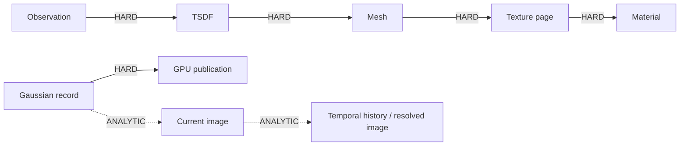

# CBRC Dependency Graph Contract

This directory defines the machine-readable dependency contract used by MAVEB-CLOSURE.

The graph traversal itself is not the scientific contribution. The research burden is deciding which dependencies are exact, which can be conservatively bounded, and whether those bounds are useful enough to reduce repair work without violating the declared output tolerance.

## Edge semantics

### HARD

Exact discrete dependencies that cannot be skipped for certification.

V1 examples:

- observation/provenance → TSDF state;
- dirty TSDF support → mesh ownership;
- mesh support → texture-page identity;
- texture page → material state;
- Gaussian source record → GPU publication;
- unstable temporal validation / disocclusion.

### ANALYTIC

A non-negative conservative finite-change bound with explicit provenance.

V1 examples:

- edited Gaussian set → current-image RGB L∞;
- stable temporal history/current image → resolved-image change.

### EMPIRICAL

Measured or predicted influence that may help ordering, profiling or future scheduling.

EMPIRICAL edges never certify by themselves. For certificate closure they are promoted to exact behavior.

## Safety rule

A false negative in a HARD dependency is a correctness failure.

An ANALYTIC edge is certificate-eligible only when its bound is implementation-backed over the declared revision domain. Local derivatives, learned influence scores and average-case measurements without a remainder bound are not certificates.

Unsupported analytic cycles fail closed in v1: repair must expand or choose FULL.

## Current production graph



The native adapter lives in `engine/cbrc/`; the generic sparse planner lives in `engine/revision/`.

## Validation

Exact dependencies should be exercised by exhaustive/tiny-scene or structural regression tests.

Analytic dependencies must additionally survive independent full-reference replay:

```
actual_error <= certified_bound
```

See [the CBRC guide](../../docs/research/CBRC.md) and [limitations](../design/CBRC_LIMITATIONS.md).
